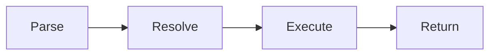
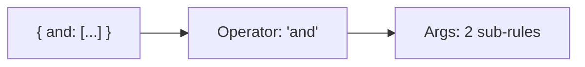
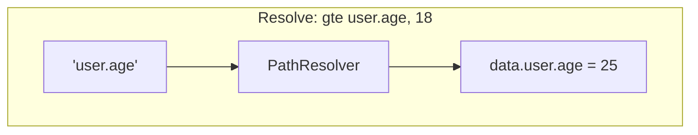
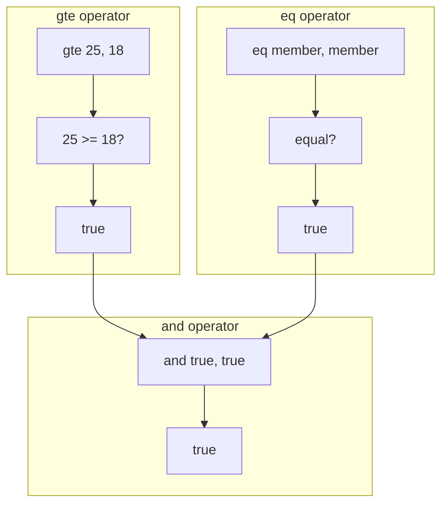
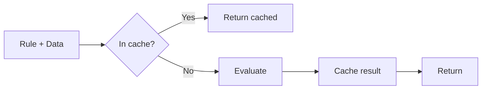
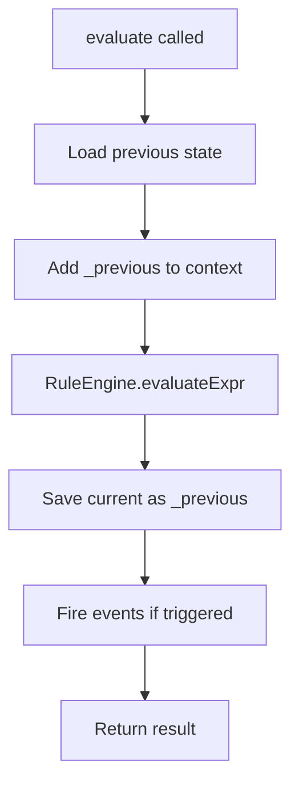
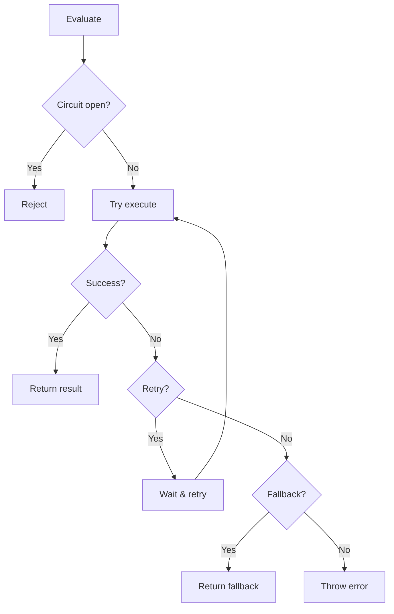

## The Evaluation Flow

When you call `evaluateExpr()`, four things happen:



Let's trace through this example:

```javascript
const rule = {
  and: [{ gte: ['user.age', 18] }, { eq: ['user.role', 'member'] }],
};

const data = {
  user: { age: 25, role: 'member' },
};

engine.evaluateExpr(rule, data);
```

---

## Step 1: Parse the Rule

Engine reads the rule and finds the operator.



The **first key** of the object is always the operator name.

---

## Step 2: Resolve Paths

For each argument, engine extracts values from your data.



```javascript
// PathResolver does this safely:
'user.age' → data.user.age → 25

// It blocks dangerous paths:
'__proto__' → blocked
'constructor' → blocked
```

---

## Step 3: Execute Operator

With resolved values, operator runs its logic.



---

## Step 4: Return Result

Engine returns a result object:

```javascript
{
  success: true,    // Did the rule pass?
  details: { ... }  // Debug info (if enabled)
}
```

---

## Caching

Engine caches results for speed. Same rule + same data = instant return.



```javascript
// First call: ~2ms (evaluates)
engine.evaluateExpr(rule, data);

// Second call: ~0.1ms (cached)
engine.evaluateExpr(rule, data);
```

---

## Stateful Evaluation

`StatefulRuleEngine` adds state tracking on top:



```javascript
// First call - no previous state
await statefulEngine.evaluate('temp-check', rule, { temp: 20 });
// { success: false, triggered: false }

// Second call - temp increased and crossed threshold
await statefulEngine.evaluate('temp-check', rule, { temp: 35 });
// { success: true, triggered: true }
// Event 'triggered' fires!
```

---

## Error Recovery Flow

When errors happen, recovery kicks in:



| Recovery            | What it does                |
| ------------------- | --------------------------- |
| **Circuit Breaker** | Stops calling failing rules |
| **Retry**           | Tries again with backoff    |
| **Fallback**        | Returns safe default        |

---

## What's Next?

<CardGroup cols={2}>
  <Card title="Internals" icon="microscope" href="/architecture/internals">
    Deep dive into source code
  </Card>
  <Card title="Operators" icon="code" href="/operators/overview">
    All 20+ operators explained
  </Card>
</CardGroup>
