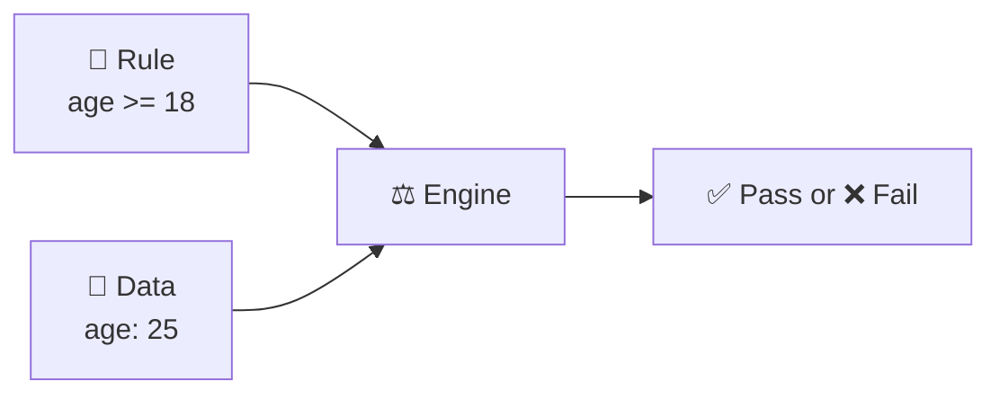
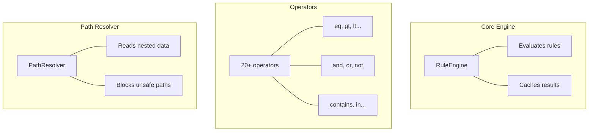
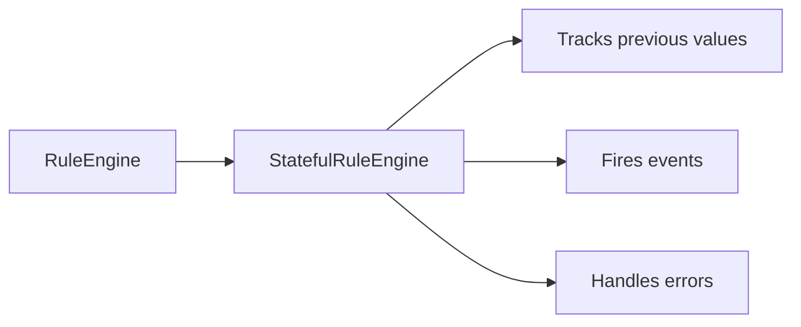

## The Core Idea

Rule Engine is like a **judge**:

- **Rules** = Laws to check
- **Context** = Evidence (your data)
- **Engine** = Judge who decides



```javascript
// This is all you need to know
const rule = { gte: ['age', 18] };
const data = { age: 25 };

engine.evaluateExpr(rule, data);
// { success: true }
```

---

## Three Building Blocks



| Block            | What it does               | Example                            |
| ---------------- | -------------------------- | ---------------------------------- |
| **RuleEngine**   | Runs rules against data    | `engine.evaluateExpr(rule, data)`  |
| **Operators**    | Logic building blocks      | `eq`, `and`, `contains`, `between` |
| **PathResolver** | Safely reads nested values | `'user.profile.age'` → `25`        |

---

## Optional: Stateful Engine

Need to track changes over time? Wrap with `StatefulRuleEngine`:



```javascript
// Detect when temperature increases above 30
const rule = {
  and: [{ increased: ['temperature'] }, { gte: ['temperature', 30] }],
};

statefulEngine.on('triggered', (e) => {
  console.log('Alert! Temperature rising');
});
```

---

## What's Next?

<CardGroup cols={2}>
  <Card title="How It Works" icon="gears" href="/architecture/how-it-works">
    Step-by-step evaluation flow
  </Card>
  <Card title="Internals" icon="microscope" href="/architecture/internals">
    Deep dive for contributors
  </Card>
</CardGroup>
