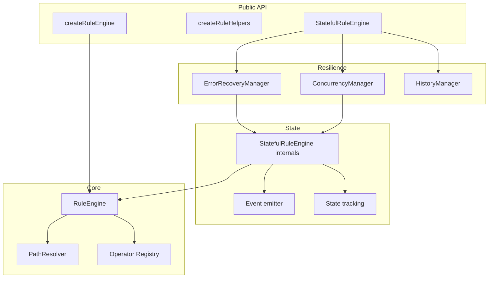
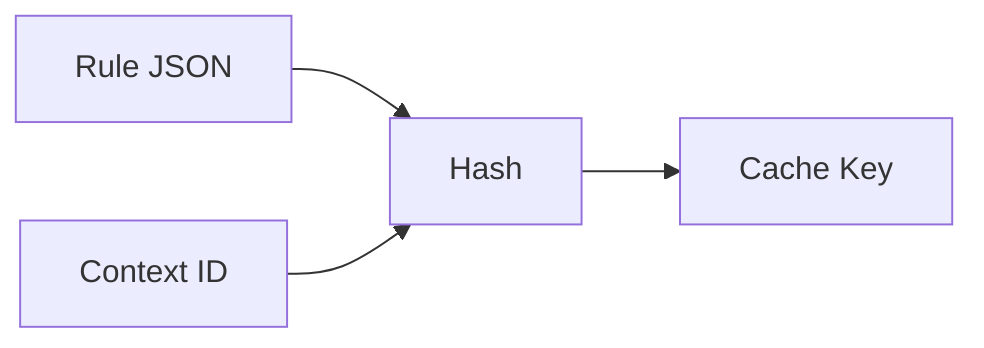
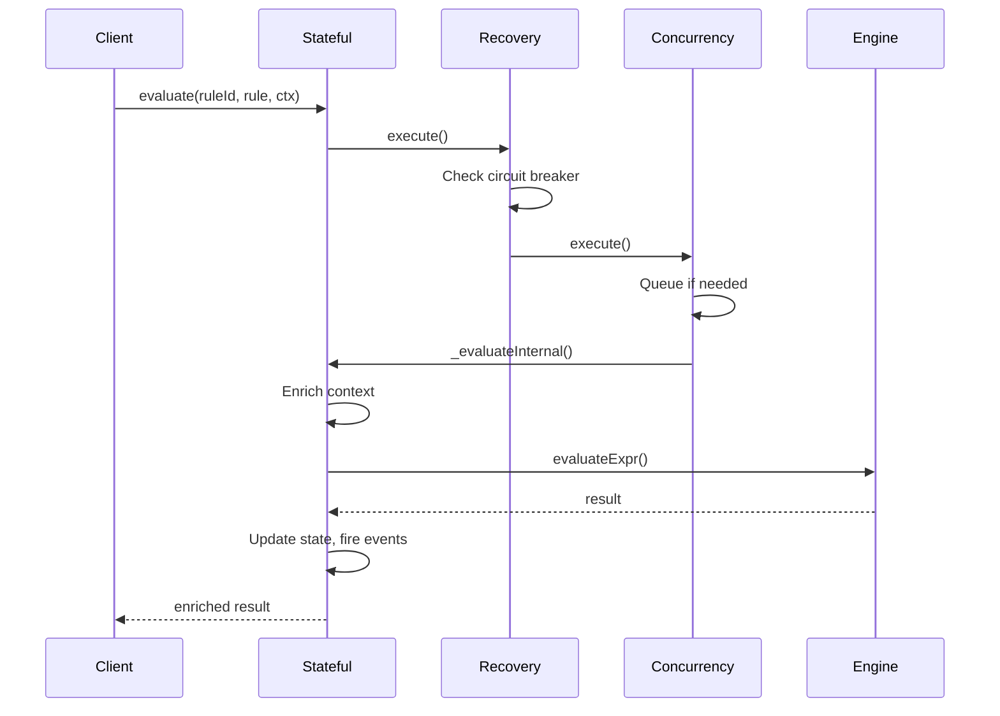
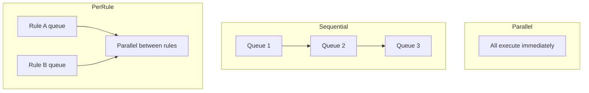
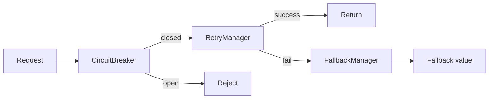
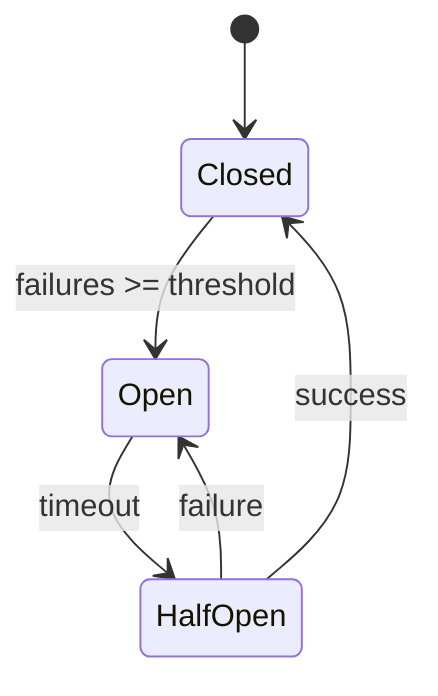
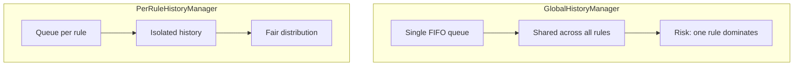

<Note>This page is for contributors who want to understand or modify the source code.</Note>

## Source Structure

```
src/
├── index.js                 # Public exports
├── core/
│   ├── RuleEngine.js        # Main engine
│   ├── PathResolver.js      # Path resolution
│   ├── StatefulRuleEngine.js
│   ├── concurrency/         # Queue management
│   ├── history/             # State history
│   └── recovery/            # Error handling
├── operators/               # All operators
├── helpers/                 # RuleHelpers fluent API
└── utils/                   # TypeUtils, errors
```

---

## Layer Architecture



---

## RuleEngine Internals

### Operator Registry

Operators are stored in a `Map`:

```javascript
// Registration
engine.operators.set('eq', {
  handler: (args, ctx) => { ... },
  options: { minArgs: 2 }
});

// Lookup
const op = engine.operators.get('eq');
op.handler(args, context);
```

### Cache Key Generation



Context ID is derived from:

1. Explicit `_id` field
2. Explicit `id` field
3. Hash of context values

---

## Operator Execution

All operators follow this signature:

```javascript
handler(args, context, evaluateExpr, depth) → boolean
```

| Param          | Purpose                      |
| -------------- | ---------------------------- |
| `args`         | Operator arguments from rule |
| `context`      | Data + `_previous` + `_meta` |
| `evaluateExpr` | Callback for nested rules    |
| `depth`        | Current nesting level        |

### Example: `eq` operator

```javascript
function eq(args, context, evaluateExpr, depth) {
  const [left, right] = args;

  const leftVal = pathResolver.resolve(context, left);
  const rightVal = pathResolver.resolve(context, right);

  return leftVal === rightVal;
}
```

---

## StatefulRuleEngine Pipeline



---

## Concurrency Strategies



| Strategy   | Use case                |
| ---------- | ----------------------- |
| Parallel   | Default, max throughput |
| Sequential | Order matters           |
| Per-Rule   | Isolate rule execution  |

---

## Error Recovery

Three components work together:



### Circuit Breaker States



### Retry Strategies

| Strategy    | Delay pattern           |
| ----------- | ----------------------- |
| Exponential | 100 → 200 → 400 → 800ms |
| Fixed       | 100 → 100 → 100 → 100ms |
| Linear      | 100 → 200 → 300 → 400ms |

---

## History Managers



Use `PerRuleHistoryManager` for production with multiple rules.

---

## Security Checks

PathResolver blocks these patterns:

```javascript
// Blocked paths
'__proto__'; // Prototype pollution
'constructor'; // Constructor access
'prototype'; // Prototype chain

// Blocked access
typeof value === 'function'; // No function calls
!obj.hasOwnProperty(key); // Only own properties
```

### Depth & Complexity Limits

| Limit          | Default | Purpose                  |
| -------------- | ------- | ------------------------ |
| `maxDepth`     | 10      | Prevent infinite nesting |
| `maxOperators` | 100     | Prevent DoS              |
| `maxCacheSize` | 1000    | Memory limit             |

---

## Design Patterns

| Pattern                     | Where                                       |
| --------------------------- | ------------------------------------------- |
| **Strategy**                | History, Concurrency, Retry managers        |
| **Factory**                 | `createRuleEngine()`, `createRuleHelpers()` |
| **Observer**                | Event system in StatefulRuleEngine          |
| **Decorator**               | StatefulRuleEngine wraps RuleEngine         |
| **Chain of Responsibility** | Error recovery pipeline                     |

---

## Key Files

| File                      | Lines | Responsibility         |
| ------------------------- | ----- | ---------------------- |
| `RuleEngine.js`           | ~400  | Core evaluation        |
| `StatefulRuleEngine.js`   | ~600  | State + events         |
| `PathResolver.js`         | ~200  | Safe path access       |
| `ErrorRecoveryManager.js` | ~300  | Recovery orchestration |

---

## Contributing

<CardGroup cols={2}>
  <Card title="Contributing Guide" icon="code-pull-request" href="/contributing">
    How to submit changes
  </Card>
  <Card title="Testing Guide" icon="vial" href="/guides/testing">
    How to write tests
  </Card>
</CardGroup>
