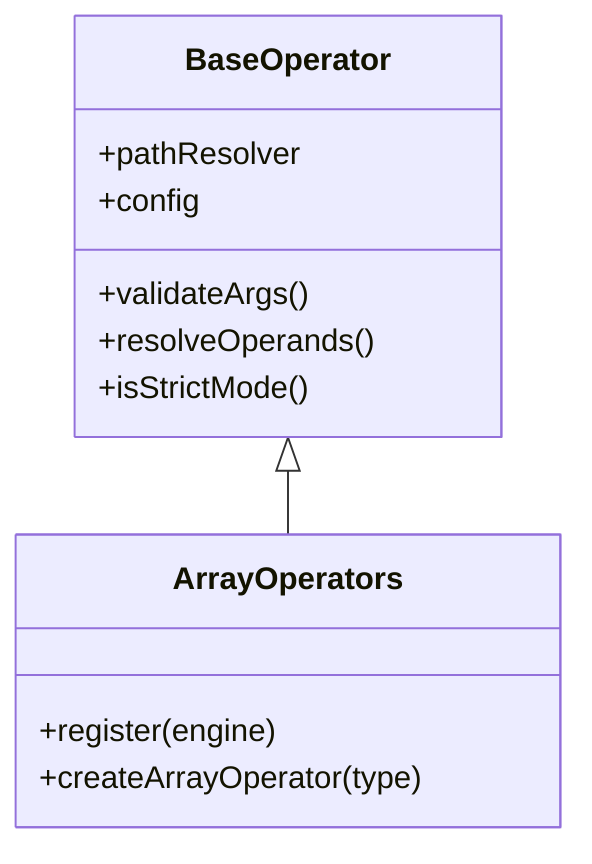

## Overview

Array operators enable checking if a value exists in a collection. Rule Engine JS provides two array membership operators:

<CardGroup cols={2}>
  <Card title="in" icon="circle-check">
    Check if value exists in array
  </Card>
  <Card title="notIn" icon="circle-xmark">
    Check if value does NOT exist in array
  </Card>
</CardGroup>

## Architecture

Array operators are implemented in the `ArrayOperators` class extending `BaseOperator`:



**Source Files:**

- Array operators: `src/operators/array.js`
- Base operator: `src/operators/base/BaseOperator.js`
- Type utilities: `src/utils/TypeUtils.js`
- Unit tests: `tests/unit/operators/array.test.js`

### Key Features

- **Dynamic arrays** - Array can be a field path or literal value
- **Dynamic values** - Value to check can also be a field path
- **Strict/loose comparison** - Control type coercion behavior
- **Case sensitive** - Exact matching for strings by default
- **Comprehensive validation** - Validates right operand is an array

## `in` - Array Membership

Check if a value exists in an array.

### Syntax

```javascript
{ in: [value, array] }
{ in: [value, array, options] }
```

### Parameters

<ParamField path="value" type="any" required>
  The value to search for - field path or literal value
</ParamField>

<ParamField path="array" type="array" required>
  The array to search in - field path or literal array
</ParamField>

<ParamField path="options" type="object" optional>
  Configuration options

  <Expandable title="properties">
    <ParamField path="strict" type="boolean" default="false">
      Enable strict equality checking (===) instead of loose (==)
    </ParamField>
  </Expandable>
</ParamField>

### Returns

`boolean` - `true` if value exists in array, `false` otherwise

### Examples

<Tabs>
  <Tab title="Basic Membership">
    ```javascript
    import { createRuleEngine } from 'rule-engine-js';

    const engine = createRuleEngine();
    const user = {
      role: 'admin',
      tags: ['premium', 'verified', 'admin'],
      permissions: ['read', 'write', 'delete']
    };

    // Check if role is in allowed list
    engine.evaluateExpr(
      { in: ['role', ['admin', 'moderator', 'user']] },
      user
    );
    // Result: { success: true }

    // Check if tag exists
    engine.evaluateExpr(
      { in: ['premium', 'tags'] },
      user
    );
    // Result: { success: true }

    // Check permission
    engine.evaluateExpr(
      { in: ['write', 'permissions'] },
      user
    );
    // Result: { success: true }

    // Value not in array
    engine.evaluateExpr(
      { in: ['role', ['guest', 'viewer']] },
      user
    );
    // Result: { success: false }
    ```
  </Tab>

  <Tab title="Dynamic Arrays">
    ```javascript
    const context = {
      user: {
        role: 'admin',
        department: 'engineering'
      },
      config: {
        allowedRoles: ['admin', 'moderator', 'user'],
        allowedDepartments: ['engineering', 'sales', 'marketing']
      }
    };

    // Both value and array are dynamic
    engine.evaluateExpr(
      { in: ['user.role', 'config.allowedRoles'] },
      context
    );
    // Result: { success: true }

    // Check department
    engine.evaluateExpr(
      { in: ['user.department', 'config.allowedDepartments'] },
      context
    );
    // Result: { success: true }
    ```
  </Tab>

  <Tab title="Number Arrays">
    ```javascript
    const data = {
      scores: [85, 90, 78, 92, 88],
      targetScore: 90,
      grades: {
        passing: [70, 75, 80, 85, 90, 95, 100]
      }
    };

    // Check if score exists
    engine.evaluateExpr(
      { in: ['targetScore', 'scores'] },
      data
    );
    // Result: { success: true }

    // Check grade threshold
    engine.evaluateExpr(
      { in: [85, 'grades.passing'] },
      data
    );
    // Result: { success: true }
    ```
  </Tab>

  <Tab title="Case Sensitivity">
    ```javascript
    const user = {
      profile: {
        skills: ['javascript', 'python', 'react', 'nodejs']
      }
    };

    // Exact match (case-sensitive)
    engine.evaluateExpr(
      { in: ['javascript', 'profile.skills'] },
      user
    );
    // Result: { success: true }

    // Case mismatch - will fail
    engine.evaluateExpr(
      { in: ['JavaScript', 'profile.skills'] },
      user
    );
    // Result: { success: false }

    // Case mismatch
    engine.evaluateExpr(
      { in: ['REACT', 'profile.skills'] },
      user
    );
    // Result: { success: false }
    ```
  </Tab>

  <Tab title="With Rule Helpers">
    ```javascript
    import { createRuleHelpers } from 'rule-engine-js';

    const rules = createRuleHelpers();
    const user = {
      role: 'editor',
      permissions: ['read', 'write']
    };

    // Cleaner syntax with helpers
    const canEdit = rules.and(
      rules.in('role', ['editor', 'admin']),
      rules.in('write', 'permissions')
    );

    engine.evaluateExpr(canEdit, user);
    // Result: { success: true }
    ```
  </Tab>
</Tabs>

### Common Use Cases

<AccordionGroup>
  <Accordion title="Role-Based Access Control">
    ```javascript
    const user = {
      role: 'editor',
      department: 'marketing'
    };

    // Allow multiple roles
    const canAccessAdmin = {
      in: ['role', ['admin', 'superadmin', 'owner']]
    };

    // Department-based access
    const canAccessReports = {
      in: ['department', ['marketing', 'sales', 'analytics']]
    };

    engine.evaluateExpr(canAccessAdmin, user);
    // Result: { success: false }

    engine.evaluateExpr(canAccessReports, user);
    // Result: { success: true }
    ```
  </Accordion>

  <Accordion title="Permission Checks">
    ```javascript
    const user = {
      id: 'user123',
      permissions: ['posts:read', 'posts:write', 'comments:read']
    };

    // Check specific permission
    const canWritePosts = {
      in: ['posts:write', 'permissions']
    };

    // Check multiple permissions
    const canManagePosts = {
      and: [
        { in: ['posts:read', 'permissions'] },
        { in: ['posts:write', 'permissions'] },
        { in: ['posts:delete', 'permissions'] }  // This will fail
      ]
    };

    engine.evaluateExpr(canWritePosts, user);
    // Result: { success: true }

    engine.evaluateExpr(canManagePosts, user);
    // Result: { success: false } - missing delete permission
    ```
  </Accordion>

  <Accordion title="Feature Flags">
    ```javascript
    const user = {
      email: 'beta@company.com',
      features: ['dark-mode', 'new-editor', 'beta-search']
    };

    // Check if feature is enabled
    const hasNewEditor = {
      in: ['new-editor', 'features']
    };

    // Multiple feature check
    const hasBetaAccess = {
      or: [
        { in: ['beta-search', 'features'] },
        { in: ['beta-analytics', 'features'] }
      ]
    };

    engine.evaluateExpr(hasNewEditor, user);
    // Result: { success: true }

    engine.evaluateExpr(hasBetaAccess, user);
    // Result: { success: true }
    ```
  </Accordion>

  <Accordion title="Tag Filtering">
    ```javascript
    const article = {
      title: 'Introduction to React',
      tags: ['react', 'javascript', 'frontend', 'tutorial']
    };

    // Search by tag
    const isReactArticle = {
      in: ['react', 'tags']
    };

    // Multiple tag filter
    const isFrontendTutorial = {
      and: [
        { in: ['frontend', 'tags'] },
        { in: ['tutorial', 'tags'] }
      ]
    };

    engine.evaluateExpr(isReactArticle, article);
    // Result: { success: true }

    engine.evaluateExpr(isFrontendTutorial, article);
    // Result: { success: true }
    ```
  </Accordion>

  <Accordion title="Status Validation">
    ```javascript
    const order = {
      status: 'processing',
      validStatuses: ['pending', 'processing', 'shipped', 'delivered']
    };

    // Validate status is in allowed list
    const validStatus = {
      in: ['status', 'validStatuses']
    };

    engine.evaluateExpr(validStatus, order);
    // Result: { success: true }

    // Check for specific statuses
    const canCancel = {
      in: ['status', ['pending', 'processing']]
    };

    engine.evaluateExpr(canCancel, order);
    // Result: { success: true }
    ```
  </Accordion>
</AccordionGroup>

<Info>
  **Performance**: Array membership uses optimized `Array.some()` with early exit for better performance.
</Info>

## `notIn` - Array Exclusion

Check if a value does NOT exist in an array (inverse of `in`).

### Syntax

```javascript
{ notIn: [value, array] }
{ notIn: [value, array, options] }
```

### Parameters

<ParamField path="value" type="any" required>
  The value to check for exclusion - field path or literal value
</ParamField>

<ParamField path="array" type="array" required>
  The array to check against - field path or literal array
</ParamField>

<ParamField path="options" type="object" optional>
  Configuration options

  <Expandable title="properties">
    <ParamField path="strict" type="boolean" default="false">
      Enable strict equality checking (===) instead of loose (==)
    </ParamField>
  </Expandable>
</ParamField>

### Returns

`boolean` - `true` if value does NOT exist in array, `false` if it exists

### Examples

<Tabs>
  <Tab title="Basic Exclusion">
    ```javascript
    const user = {
      role: 'admin',
      status: 'active',
      tags: ['premium', 'verified']
    };

    // Ensure role is not in banned list
    engine.evaluateExpr(
      { notIn: ['role', ['guest', 'banned', 'suspended']] },
      user
    );
    // Result: { success: true }

    // Check tag is not present
    engine.evaluateExpr(
      { notIn: ['spam', 'tags'] },
      user
    );
    // Result: { success: true }

    // This will fail (admin is in the list)
    engine.evaluateExpr(
      { notIn: ['role', ['admin', 'moderator']] },
      user
    );
    // Result: { success: false }
    ```
  </Tab>

  <Tab title="Account Validation">
    ```javascript
    const account = {
      username: 'john_doe',
      email: 'john@example.com',
      reservedUsernames: ['admin', 'root', 'system', 'moderator']
    };

    // Ensure username is not reserved
    const validUsername = {
      notIn: ['username', 'reservedUsernames']
    };

    engine.evaluateExpr(validUsername, account);
    // Result: { success: true }

    // Try with reserved username
    const invalidUser = {
      username: 'admin',
      reservedUsernames: ['admin', 'root', 'system']
    };

    engine.evaluateExpr(validUsername, invalidUser);
    // Result: { success: false }
    ```
  </Tab>

  <Tab title="Security Checks">
    ```javascript
    const request = {
      userRole: 'user',
      requestedPath: '/dashboard',
      blockedRoles: ['guest', 'banned', 'suspended'],
      restrictedPaths: ['/admin', '/settings', '/users']
    };

    // Ensure user is not blocked
    const notBlocked = {
      and: [
        { notIn: ['userRole', 'blockedRoles'] },
        { notIn: ['requestedPath', 'restrictedPaths'] }
      ]
    };

    engine.evaluateExpr(notBlocked, request);
    // Result: { success: true }
    ```
  </Tab>

  <Tab title="Content Filtering">
    ```javascript
    const post = {
      content: 'Great product!',
      keywords: ['product', 'great'],
      bannedWords: ['spam', 'scam', 'fake', 'virus']
    };

    // Filter spam content
    const notSpam = {
      and: [
        { notIn: ['spam', 'keywords'] },
        { notIn: ['scam', 'keywords'] },
        { notIn: ['fake', 'keywords'] }
      ]
    };

    engine.evaluateExpr(notSpam, post);
    // Result: { success: true }
    ```
  </Tab>

  <Tab title="Dynamic Exclusion">
    ```javascript
    const context = {
      user: {
        role: 'editor',
        department: 'engineering'
      },
      config: {
        bannedRoles: ['guest', 'suspended'],
        restrictedDepartments: ['legal', 'hr']
      }
    };

    // Check user is not banned and not in restricted dept
    const hasAccess = {
      and: [
        { notIn: ['user.role', 'config.bannedRoles'] },
        { notIn: ['user.department', 'config.restrictedDepartments'] }
      ]
    };

    engine.evaluateExpr(hasAccess, context);
    // Result: { success: true }
    ```
  </Tab>
</Tabs>

### Common Use Cases

<AccordionGroup>
  <Accordion title="Blacklist Validation">
    ```javascript
    const user = {
      email: 'user@example.com',
      ip: '192.168.1.100',
      blockedEmails: ['spam@test.com', 'fake@test.com'],
      blockedIPs: ['10.0.0.1', '192.168.1.50']
    };

    // Ensure user is not blacklisted
    const notBlacklisted = {
      and: [
        { notIn: ['email', 'blockedEmails'] },
        { notIn: ['ip', 'blockedIPs'] }
      ]
    };

    engine.evaluateExpr(notBlacklisted, user);
    // Result: { success: true }
    ```
  </Accordion>

  <Accordion title="Status Guards">
    ```javascript
    const order = {
      status: 'processing',
      completedStatuses: ['shipped', 'delivered', 'cancelled']
    };

    // Can still modify order (not in completed statuses)
    const canModify = {
      notIn: ['status', 'completedStatuses']
    };

    engine.evaluateExpr(canModify, order);
    // Result: { success: true }

    // Order not in these states
    const notFinal = {
      notIn: ['status', ['cancelled', 'refunded']]
    };

    engine.evaluateExpr(notFinal, order);
    // Result: { success: true }
    ```
  </Accordion>

  <Accordion title="Platform Restrictions">
    ```javascript
    const device = {
      platform: 'ios',
      version: '15.0',
      unsupportedPlatforms: ['windows-phone', 'blackberry'],
      deprecatedVersions: ['14.0', '14.1', '14.2']
    };

    // Check platform is supported
    const isSupported = {
      and: [
        { notIn: ['platform', 'unsupportedPlatforms'] },
        { notIn: ['version', 'deprecatedVersions'] }
      ]
    };

    engine.evaluateExpr(isSupported, device);
    // Result: { success: true }
    ```
  </Accordion>

  <Accordion title="File Type Restrictions">
    ```javascript
    const upload = {
      filename: 'document.pdf',
      extension: '.pdf',
      blockedExtensions: ['.exe', '.bat', '.sh', '.cmd']
    };

    // Ensure file type is allowed
    const safeFileType = {
      notIn: ['extension', 'blockedExtensions']
    };

    engine.evaluateExpr(safeFileType, upload);
    // Result: { success: true }
    ```
  </Accordion>
</AccordionGroup>

<Warning>
  For checking if value is NOT in a **literal** array of 2-3 items, `notIn` is clearer than multiple `neq` operators combined with `and`.
</Warning>

## Error Handling

### Common Errors

<AccordionGroup>
  <Accordion title="Non-Array Right Operand">
    ```javascript
    const data = {
      user: {
        role: 'admin',
        name: 'John Doe'  // Not an array
      }
    };

    // Trying to use IN with non-array
    const result = engine.evaluateExpr(
      { in: ['admin', 'user.name'] },
      data
    );

    // Returns:
    // {
    //   success: false,
    //   error: "IN operator requires array as right operand",
    //   details: {
    //     rightType: "string",
    //     originalRight: "user.name"
    //   }
    // }
    ```
  </Accordion>

  <Accordion title="Undefined Array Field">
    ```javascript
    const data = {
      user: { role: 'admin' }
      // Missing 'permissions' field
    };

    // Field doesn't exist
    const result = engine.evaluateExpr(
      { in: ['read', 'user.permissions'] },
      data
    );

    // Returns:
    // {
    //   success: false,
    //   error: "IN operator requires array as right operand"
    // }
    ```
  </Accordion>

  <Accordion title="Missing Arguments">
    ```javascript
    // Missing second argument
    const result = engine.evaluateExpr(
      { in: ['admin'] },
      data
    );

    // Returns:
    // {
    //   success: false,
    //   error: "IN operator requires 2-3 arguments, got 1"
    // }
    ```
  </Accordion>

  <Accordion title="Literal String Instead of Array">
    ```javascript
    const data = { role: 'admin' };

    // Passing string instead of array
    const result = engine.evaluateExpr(
      { in: ['role', 'admin,moderator'] },  // Wrong: string not array
      data
    );

    // Returns:
    // {
    //   success: false,
    //   error: "IN operator requires array as right operand"
    // }

    // Correct usage:
    const correctResult = engine.evaluateExpr(
      { in: ['role', ['admin', 'moderator']] },  // Correct: array
      data
    );
    // Result: { success: true }
    ```
  </Accordion>
</AccordionGroup>

### Safe Error Handling

```javascript
function safeArrayCheck(engine, operator, value, array, data, fallback = false) {
  // Validate array field exists and is array
  const resolvedArray = engine.resolvePath(data, array);

  if (!Array.isArray(resolvedArray)) {
    console.error(`Field '${array}' is not an array`);
    return fallback;
  }

  const result = engine.evaluateExpr(
    { [operator]: [value, array] },
    data
  );

  if (!result.success) {
    console.error(`Array check failed: ${result.error}`);
    return fallback;
  }

  return result.success;
}

// Usage
const hasPermission = safeArrayCheck(
  engine,
  'in',
  'write',
  'user.permissions',
  userData,
  false
);
```

## Type Coercion & Comparison

Array operators use `TypeUtils.isEqual()` for element comparison:

### Loose Mode (Default)

```javascript
const data = {
  numbers: [1, 2, 3],
  strings: ['1', '2', '3']
};

// Loose equality - type coercion enabled
engine.evaluateExpr({ in: [1, 'strings'] }, data);
// Result: { success: true } - 1 == '1'

engine.evaluateExpr({ in: ['2', 'numbers'] }, data);
// Result: { success: true } - '2' == 2
```

### Strict Mode

```javascript
const strictEngine = createRuleEngine({ strict: true });

// Strict equality - no type coercion
strictEngine.evaluateExpr({ in: [1, 'strings'] }, data);
// Result: { success: false } - 1 !== '1'

strictEngine.evaluateExpr({ in: ['2', 'numbers'] }, data);
// Result: { success: false } - '2' !== 2

// Per-rule strict mode
engine.evaluateExpr(
  { in: [1, 'strings', { strict: true }] },
  data
);
// Result: { success: false }
```

### Comparison Table

| Value Type | Array Element | Loose Mode | Strict Mode |
|------------|---------------|------------|-------------|
| `1` | `1` | ✅ Match | ✅ Match |
| `1` | `'1'` | ✅ Match | ❌ No match |
| `'true'` | `true` | ❌ No match | ❌ No match |
| `null` | `undefined` | ❌ No match | ❌ No match |

<Tip>
  Use strict mode in production to prevent unexpected type coercion bugs when checking array membership.
</Tip>

## Related Operators

<CardGroup cols={3}>
  <Card title="Comparison Operators" icon="equals" href="/operators/comparison">
    eq, neq for single value checks
  </Card>
  <Card title="String Operators" icon="text" href="/operators/string">
    contains, startsWith, endsWith
  </Card>
  <Card title="Special Operators" icon="star" href="/operators/special">
    isNull, isNotNull, between
  </Card>
  <Card title="Logical Operators" icon="circle-nodes" href="/operators/logical">
    and, or, not for combining rules
  </Card>
  <Card title="State Operators" icon="chart-line" href="/operators/state">
    changed, changedTo, changedFrom
  </Card>
  <Card title="All Operators" icon="list-check" href="/operators/overview">
    Complete operator reference
  </Card>
</CardGroup>

## API Reference

For complete API documentation:

- [RuleEngine API](/api-reference/rule-engine)
- [Rule Helpers API](/api-reference/rule-helpers)
- [Performance Guide](/guides/performance)
- [Custom Operators](/guides/custom-operators)
