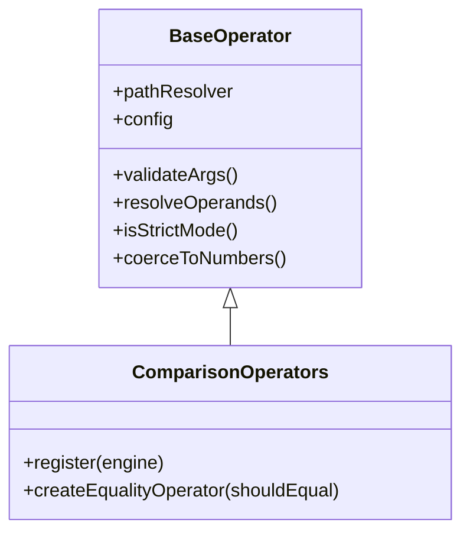

## Overview

Equality operators compare values for equality or inequality. Rule Engine JS provides two equality comparison operators:

<CardGroup cols={2}>
  <Card title="eq" icon="equals">
    Tests if two values are equal
  </Card>
  <Card title="neq" icon="not-equal">
    Tests if two values are not equal
  </Card>
</CardGroup>

## Architecture

Equality operators are implemented in the `ComparisonOperators` class which extends `BaseOperator`:



**Source Files:**

- Equality operators: `src/operators/comparison.js`
- Base operator: `src/operators/base/BaseOperator.js`
- Type utilities: `src/utils/TypeUtils.js`
- Unit tests: `tests/unit/operators/comparison.test.js`

### Key Features

- **Dynamic field comparison** - Compare two fields or a field to a literal value
- **Strict/loose modes** - Control type coercion behavior (`==` vs `===`)
- **Type-safe equality** - Handles primitives, objects, arrays, null, undefined
- **Comprehensive validation** - Validates argument count and types

## `eq` - Equals

Tests if two values are equal.

### Syntax

```javascript
{
  eq: [left, right];
}
{
  eq: [left, right, options];
}
```

### Parameters

<ParamField path="left" type="string | any" required>
  Left operand - field path or literal value
</ParamField>

<ParamField path="right" type="string | any" required>
  Right operand - field path or literal value
</ParamField>

<ParamField path="options" type="object" optional>
  Configuration options

  <Expandable title="properties">
    <ParamField path="strict" type="boolean" default="false">
      Enable strict equality (`===`) instead of loose (`==`)
    </ParamField>
  </Expandable>
</ParamField>

### Returns

`boolean` - `true` if values are equal, `false` otherwise

### Examples

<Tabs>
  <Tab title="Basic Equality">
    ```javascript
    import { createRuleEngine } from 'rule-engine-js';

    const engine = createRuleEngine();
    const data = {
      user: {
        name: 'John Doe',
        age: 28,
        active: true
      }
    };

    // String equality
    engine.evaluateExpr({ eq: ['user.name', 'John Doe'] }, data);
    // Result: { success: true, value: true }

    // Numeric equality
    engine.evaluateExpr({ eq: ['user.age', 28] }, data);
    // Result: { success: true, value: true }

    // Boolean equality
    engine.evaluateExpr({ eq: ['user.active', true] }, data);
    // Result: { success: true, value: true }

    // Fails when not equal
    engine.evaluateExpr({ eq: ['user.name', 'Jane Doe'] }, data);
    // Result: { success: true, value: false }
    ```

  </Tab>

  <Tab title="Dynamic Field Comparison">
    ```javascript
    const formData = {
      password: 'secret123',
      confirmPassword: 'secret123',
      email: 'user@example.com',
      confirmEmail: 'user@example.com'
    };

    // Compare two fields
    engine.evaluateExpr({ eq: ['password', 'confirmPassword'] }, formData);
    // Result: { success: true, value: true }

    // Email confirmation
    engine.evaluateExpr({ eq: ['email', 'confirmEmail'] }, formData);
    // Result: { success: true, value: true }

    // Combined validation
    const validForm = {
      and: [
        { eq: ['password', 'confirmPassword'] },
        { eq: ['email', 'confirmEmail'] }
      ]
    };
    engine.evaluateExpr(validForm, formData);
    // Result: { success: true, value: true }
    ```

  </Tab>

  <Tab title="Strict vs Loose Mode">
    ```javascript
    const data = { score: 25 };

    // Loose equality (default) - type coercion enabled
    engine.evaluateExpr({ eq: ['score', '25'] }, data);
    // Result: { success: true, value: true } (25 == '25')

    // Strict equality - no type coercion
    engine.evaluateExpr({ eq: ['score', '25', { strict: true }] }, data);
    // Result: { success: true, value: false } (25 !== '25')

    // Global strict mode
    const strictEngine = createRuleEngine({ strict: true });
    strictEngine.evaluateExpr({ eq: ['score', '25'] }, data);
    // Result: { success: true, value: false }
    ```

  </Tab>

  <Tab title="With Rule Helpers">
    ```javascript
    import { createRuleHelpers } from 'rule-engine-js';

    const rules = createRuleHelpers();
    const data = { user: { role: 'admin', status: 'active' } };

    // Using helpers for cleaner syntax
    const rule = rules.and(
      rules.eq('user.role', 'admin'),
      rules.eq('user.status', 'active')
    );

    engine.evaluateExpr(rule, data);
    // Result: { success: true, value: true }
    ```

  </Tab>
</Tabs>

### Common Use Cases

<AccordionGroup>
  <Accordion title="Form Field Validation">
    ```javascript
    const registration = {
      password: 'SecurePass123!',
      confirmPassword: 'SecurePass123!',
      email: 'user@example.com',
      confirmEmail: 'user@example.com'
    };

    const validation = {
      and: [
        { eq: ['password', 'confirmPassword'] },
        { eq: ['email', 'confirmEmail'] }
      ]
    };

    engine.evaluateExpr(validation, registration);
    // Result: { success: true, value: true }
    ```

  </Accordion>

  <Accordion title="Role-Based Access Control">
    ```javascript
    const user = {
      role: 'admin',
      status: 'active',
      department: 'engineering'
    };

    const canAccessAdminPanel = {
      and: [
        { eq: ['role', 'admin'] },
        { eq: ['status', 'active'] }
      ]
    };

    engine.evaluateExpr(canAccessAdminPanel, user);
    // Result: { success: true, value: true }
    ```

  </Accordion>

  <Accordion title="Configuration Validation">
    ```javascript
    const config = {
      environment: 'production',
      debugMode: false,
      maintenanceMode: false
    };

    const canServeTraffic = {
      and: [
        { eq: ['environment', 'production'] },
        { eq: ['debugMode', false] },
        { eq: ['maintenanceMode', false] }
      ]
    };

    engine.evaluateExpr(canServeTraffic, config);
    // Result: { success: true, value: true }
    ```

  </Accordion>

  <Accordion title="Null/Undefined Handling">
    ```javascript
    const data = {
      user: {
        name: 'John',
        middleName: null
        // lastName is undefined
      }
    };

    // Check for null
    engine.evaluateExpr({ eq: ['user.middleName', null] }, data);
    // Result: { success: true, value: true }

    // Undefined field
    engine.evaluateExpr({ eq: ['user.lastName', undefined] }, data);
    // Result: { success: true, value: true }

    // Note: Consider using isNull/isNotNull operators instead
    ```

  </Accordion>
</AccordionGroup>

<Info>
**Type Coercion**: By default, `eq` uses loose equality (`==`). Use `{ strict: true }` or create a strict engine for type-safe comparisons.
</Info>

## `neq` - Not Equal

Tests if two values are not equal (inverse of `eq`).

### Syntax

```javascript
{
  neq: [left, right];
}
{
  neq: [left, right, options];
}
```

### Parameters

<ParamField path="left" type="string | any" required>
  Left operand - field path or literal value
</ParamField>

<ParamField path="right" type="string | any" required>
  Right operand - field path or literal value
</ParamField>

<ParamField path="options" type="object" optional>
  Configuration options

  <Expandable title="properties">
    <ParamField path="strict" type="boolean" default="false">
      Enable strict inequality (`!==`) instead of loose (`!=`)
    </ParamField>
  </Expandable>
</ParamField>

### Returns

`boolean` - `true` if values are not equal, `false` otherwise

### Examples

<Tabs>
  <Tab title="Status Checks">
    ```javascript
    const data = {
      user: {
        status: 'active',
        role: 'editor'
      }
    };

    // Ensure not inactive
    engine.evaluateExpr({ neq: ['user.status', 'inactive'] }, data);
    // Result: { success: true, value: true }

    // Fails when equal
    engine.evaluateExpr({ neq: ['user.status', 'active'] }, data);
    // Result: { success: true, value: false }

    // Multiple exclusions
    const notBannedOrSuspended = {
      and: [
        { neq: ['user.status', 'banned'] },
        { neq: ['user.status', 'suspended'] }
      ]
    };
    engine.evaluateExpr(notBannedOrSuspended, data);
    // Result: { success: true, value: true }
    ```

  </Tab>

  <Tab title="Password Change Validation">
    ```javascript
    const formData = {
      currentPassword: 'old_pass',
      newPassword: 'new_pass123'
    };

    // Ensure password changed
    const passwordDifferent = {
      neq: ['currentPassword', 'newPassword']
    };

    engine.evaluateExpr(passwordDifferent, formData);
    // Result: { success: true, value: true }
    ```

  </Tab>

  <Tab title="Reserved Name Check">
    ```javascript
    const user = {
      username: 'john_doe'
    };

    // Username not reserved
    const notReserved = {
      and: [
        { neq: ['username', 'admin'] },
        { neq: ['username', 'root'] },
        { neq: ['username', 'system'] }
      ]
    };

    engine.evaluateExpr(notReserved, user);
    // Result: { success: true, value: true }
    ```

  </Tab>

  <Tab title="Change Detection">
    ```javascript
    const data = {
      currentValue: 100,
      previousValue: 95
    };

    // Detect value change
    engine.evaluateExpr({ neq: ['currentValue', 'previousValue'] }, data);
    // Result: { success: true, value: true }

    // Note: For state tracking, use the 'changed' operator instead
    ```

  </Tab>
</Tabs>

### Common Use Cases

<AccordionGroup>
  <Accordion title="Access Control">
    ```javascript
    const user = {
      role: 'editor',
      status: 'active',
      accountType: 'premium'
    };

    // Not a basic user
    const hasAdvancedAccess = {
      and: [
        { neq: ['role', 'viewer'] },
        { neq: ['accountType', 'free'] },
        { eq: ['status', 'active'] }
      ]
    };

    engine.evaluateExpr(hasAdvancedAccess, user);
    // Result: { success: true, value: true }
    ```

  </Accordion>

  <Accordion title="Duplicate Prevention">
    ```javascript
    const form = {
      email: 'user@example.com',
      alternateEmail: 'alternate@example.com'
    };

    // Emails must be different
    const uniqueEmails = { neq: ['email', 'alternateEmail'] };

    engine.evaluateExpr(uniqueEmails, form);
    // Result: { success: true, value: true }
    ```

  </Accordion>

  <Accordion title="State Transition Guards">
    ```javascript
    const workflow = {
      currentState: 'pending',
      previousState: 'draft'
    };

    // Ensure state actually changed
    const stateChanged = {
      neq: ['currentState', 'previousState']
    };

    engine.evaluateExpr(stateChanged, workflow);
    // Result: { success: true, value: true }
    ```

  </Accordion>
</AccordionGroup>

<Warning>
  For checking if a value is NOT in a list, prefer the `notIn` operator instead of multiple `neq`
  conditions.
</Warning>

## Error Handling

### Common Errors

<AccordionGroup>
  <Accordion title="Invalid Argument Count">
    ```javascript
    // Missing second argument
    const result = engine.evaluateExpr({ eq: ['user.name'] }, data);

    // Returns:
    // {
    //   success: false,
    //   error: "EQ operator requires 2-3 arguments, got 1"
    // }
    ```

  </Accordion>

  <Accordion title="Non-Array Arguments">
    ```javascript
    // Missing array brackets
    const result = engine.evaluateExpr({ eq: 'user.name' }, data);

    // Returns:
    // {
    //   success: false,
    //   error: "EQ operator requires array arguments"
    // }
    ```

  </Accordion>

  <Accordion title="Undefined Field Access">
    ```javascript
    const data = { user: { name: 'John' } };

    // Field doesn't exist - not an error, returns false
    const result = engine.evaluateExpr({ eq: ['user.age', 25] }, data);

    // Returns:
    // {
    //   success: true,
    //   value: false  // undefined !== 25
    // }
    ```

  </Accordion>
</AccordionGroup>

### Error Recovery

```javascript
function safeEquals(engine, field, expected, data, fallback = false) {
  const result = engine.evaluateExpr({ eq: [field, expected] }, data);

  if (!result.success) {
    console.error('Evaluation failed:', result.error);
    return fallback;
  }

  return result.value;
}

// Usage
const isAdmin = safeEquals(engine, 'user.role', 'admin', userData, false);
```

## Type Coercion

Equality operators support both strict and loose comparison modes:

| Mode            | Symbol        | Behavior              | Example                 |
| --------------- | ------------- | --------------------- | ----------------------- |
| Loose (default) | `==` / `!=`   | Type coercion enabled | `25 == '25'` → `true`   |
| Strict          | `===` / `!==` | No type coercion      | `25 === '25'` → `false` |

### Setting Strict Mode

<CodeGroup>
```javascript Global Strict Mode
// All rules use strict comparison
const engine = createRuleEngine({ strict: true });

engine.evaluateExpr({ eq: ['age', '25'] }, { age: 25 });
// Result: { success: true, value: false }

````

```javascript Per-Rule Strict Mode
// Default engine (loose mode)
const engine = createRuleEngine();

// Override for specific rule
engine.evaluateExpr(
  { eq: ['age', '25', { strict: true }] },
  { age: 25 }
);
// Result: { success: true, value: false }
````

```javascript Per-Rule Loose Override
// Strict engine
const engine = createRuleEngine({ strict: true });

// Override for specific rule
engine.evaluateExpr({ eq: ['age', '25', { strict: false }] }, { age: 25 });
// Result: { success: true, value: true }
```

</CodeGroup>

<Tip>Use strict mode in production to prevent unexpected type coercion bugs.</Tip>

## Related Operators

<CardGroup cols={3}>
  <Card title="Numeric Operators" icon="greater-than" href="/operators/numeric">
    GT, GTE, LT, LTE
  </Card>
  <Card title="Special Operators" icon="star" href="/operators/special">
    isNull, isNotNull, between
  </Card>
  <Card title="Array Operators" icon="list" href="/operators/array">
    in, notIn
  </Card>
  <Card title="Logical Operators" icon="circle-nodes" href="/operators/logical">
    and, or, not
  </Card>
  <Card title="State Operators" icon="chart-line" href="/operators/state">
    changed, changedTo, changedFrom
  </Card>
  <Card title="All Operators" icon="list-check" href="/operators/overview">
    Complete operator reference
  </Card>
</CardGroup>

## API Reference

For complete API documentation:

- [RuleEngine API](/api-reference/rule-engine)
- [Rule Helpers API](/api-reference/rule-helpers)
- [Performance Guide](/guides/performance)
- [Custom Operators](/guides/custom-operators)
