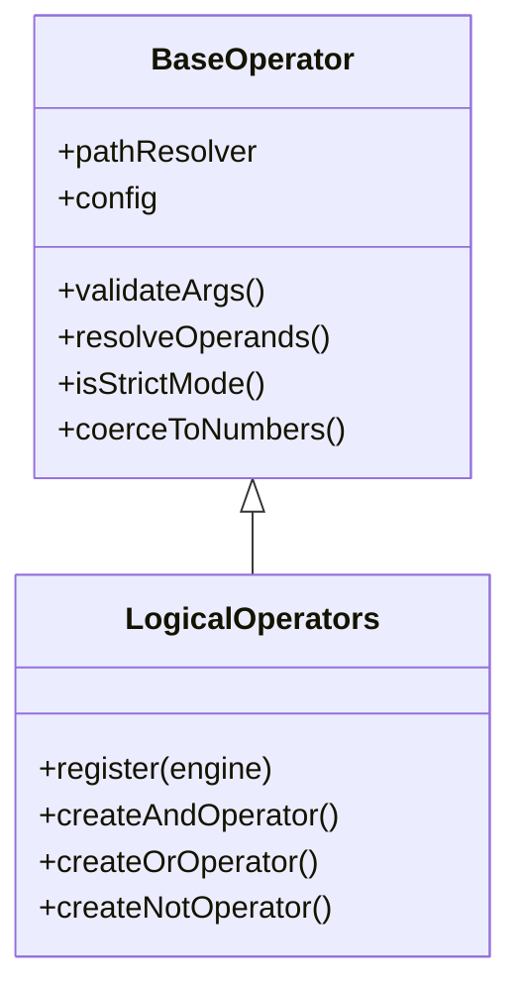

## Overview

Logical operators let you combine multiple conditions together. Think of them like building blocks for complex rules.

<CardGroup cols={3}>
  <Card title="and" icon="check-double">
    All conditions must be true
  </Card>
  <Card title="or" icon="list-check">
    At least one condition must be true
  </Card>
  <Card title="not" icon="xmark">
    Reverses a condition
  </Card>
</CardGroup>

## Architecture

Logical operators are implemented in the `LogicalOperators` class:



**Source Files:**

- Logical operators: `src/operators/logical.js`
- Base operator: `src/operators/base/BaseOperator.js`
- Unit tests: `tests/unit/operators/logical.test.js`

### Key Features

- **Short-circuit evaluation** - Stops checking as soon as result is known
- **Unlimited nesting** - Combine operators inside each other
- **Works with any operator** - Combine comparison, string, array operators, etc.
- **Clear error messages** - Helpful feedback when something goes wrong

## `and` - All Must Be True

All conditions must pass for the rule to pass. Like saying "I need this AND that AND those."

### Syntax

```javascript
{ and: [condition1, condition2, ...] }
```

### Parameters

<ParamField path="conditions" type="array" required>
  Array of rule conditions (minimum 1 condition)
</ParamField>

### Returns

`boolean` - `true` only if **all** conditions are true

### How It Works

```
✓ true  AND ✓ true  = ✓ true
✓ true  AND ✗ false = ✗ false
✗ false AND ✓ true  = ✗ false
✗ false AND ✗ false = ✗ false
```

### Examples

<Tabs>
  <Tab title="Basic AND">
    ```javascript
    import { createRuleEngine } from 'rule-engine-js';

    const engine = createRuleEngine();
    const user = {
      age: 28,
      role: 'admin',
      active: true
    };

    // All three conditions must be true
    const rule = {
      and: [
        { gte: ['age', 18] },        // ✓ 28 >= 18
        { eq: ['role', 'admin'] },   // ✓ role is admin
        { eq: ['active', true] }     // ✓ active is true
      ]
    };

    engine.evaluateExpr(rule, user);
    // Result: { success: true, value: true }

    // If ANY condition fails, AND fails
    const failRule = {
      and: [
        { gte: ['age', 18] },        // ✓ true
        { eq: ['role', 'guest'] }    // ✗ false (role is 'admin', not 'guest')
      ]
    };

    engine.evaluateExpr(failRule, user);
    // Result: { success: true, value: false }
    ```

  </Tab>

  <Tab title="Access Control">
    ```javascript
    const user = {
      role: 'editor',
      department: 'sales',
      status: 'active',
      yearsOfService: 3
    };

    // User needs ALL of these to edit sales reports
    const canEditSalesReports = {
      and: [
        { eq: ['role', 'editor'] },
        { eq: ['department', 'sales'] },
        { eq: ['status', 'active'] },
        { gte: ['yearsOfService', 2] }
      ]
    };

    engine.evaluateExpr(canEditSalesReports, user);
    // Result: { success: true, value: true }
    ```

  </Tab>

  <Tab title="Nested AND">
    ```javascript
    const order = {
      total: 150,
      paymentStatus: 'paid',
      shippingAddress: 'valid',
      itemsInStock: true
    };

    // Complex validation with nested AND
    const canShipOrder = {
      and: [
        { gte: ['total', 100] },
        { eq: ['paymentStatus', 'paid'] },
        {
          and: [
            { eq: ['shippingAddress', 'valid'] },
            { eq: ['itemsInStock', true] }
          ]
        }
      ]
    };

    engine.evaluateExpr(canShipOrder, order);
    // Result: { success: true, value: true }
    ```

  </Tab>

  <Tab title="With Rule Helpers">
    ```javascript
    import { createRuleHelpers } from 'rule-engine-js';

    const rules = createRuleHelpers();
    const user = { age: 25, email: 'user@company.com', verified: true };

    // Cleaner syntax with helpers
    const canAccess = rules.and(
      rules.gte('age', 18),
      rules.contains('email', '@company.com'),
      rules.eq('verified', true)
    );

    engine.evaluateExpr(canAccess, user);
    // Result: { success: true, value: true }
    ```

  </Tab>
</Tabs>

### Common Use Cases

<AccordionGroup>
  <Accordion title="User Permissions">
    ```javascript
    // User needs specific role AND active status
    const hasPermission = {
      and: [
        { eq: ['role', 'admin'] },
        { eq: ['status', 'active'] },
        { neq: ['banned', true] }
      ]
    };
    ```
  </Accordion>

  <Accordion title="Form Validation">
    ```javascript
    // All fields must be valid
    const validForm = {
      and: [
        { isNotNull: ['username'] },
        { regex: ['email', '^[^@]+@[^@]+$'] },
        { gte: ['age', 18] },
        { eq: ['terms', true] }
      ]
    };
    ```
  </Accordion>

  <Accordion title="Price Range">
    ```javascript
    // Price must be within range
    const validPrice = {
      and: [
        { gte: ['price', 10] },    // At least $10
        { lte: ['price', 100] }    // At most $100
      ]
    };
    ```
  </Accordion>
</AccordionGroup>

<Info>
  **Short-circuit**: AND stops checking as soon as it finds a false condition, making it faster.
</Info>

## `or` - At Least One Must Be True

At least one condition must pass. Like saying "I need this OR that OR those."

### Syntax

```javascript
{ or: [condition1, condition2, ...] }
```

### Parameters

<ParamField path="conditions" type="array" required>
  Array of rule conditions (minimum 1 condition)
</ParamField>

### Returns

`boolean` - `true` if **any** condition is true

### How It Works

```
✓ true  OR ✓ true  = ✓ true
✓ true  OR ✗ false = ✓ true
✗ false OR ✓ true  = ✓ true
✗ false OR ✗ false = ✗ false
```

### Examples

<Tabs>
  <Tab title="Basic OR">
    ```javascript
    const user = {
      role: 'editor',
      isOwner: false,
      isModerator: false
    };

    // User needs at least ONE of these roles
    const canEdit = {
      or: [
        { eq: ['role', 'admin'] },      // ✗ false
        { eq: ['role', 'editor'] },     // ✓ true (this one passes!)
        { eq: ['isOwner', true] },      // ✗ false
        { eq: ['isModerator', true] }   // ✗ false
      ]
    };

    engine.evaluateExpr(canEdit, user);
    // Result: { success: true, value: true }

    // All conditions must fail for OR to fail
    const noAccess = {
      or: [
        { eq: ['role', 'admin'] },      // ✗ false
        { eq: ['isOwner', true] }       // ✗ false
      ]
    };

    engine.evaluateExpr(noAccess, user);
    // Result: { success: true, value: false }
    ```

  </Tab>

  <Tab title="Multiple Payment Methods">
    ```javascript
    const payment = {
      creditCard: null,
      paypal: 'active',
      bankTransfer: null
    };

    // Accept any payment method
    const hasPaymentMethod = {
      or: [
        { isNotNull: ['creditCard'] },
        { eq: ['paypal', 'active'] },
        { isNotNull: ['bankTransfer'] }
      ]
    };

    engine.evaluateExpr(hasPaymentMethod, payment);
    // Result: { success: true, value: true }
    ```

  </Tab>

  <Tab title="Nested OR">
    ```javascript
    const user = {
      subscription: 'free',
      trialActive: false,
      specialAccess: true
    };

    // Premium access through any method
    const hasPremiumAccess = {
      or: [
        { eq: ['subscription', 'premium'] },
        { eq: ['subscription', 'pro'] },
        {
          or: [
            { eq: ['trialActive', true] },
            { eq: ['specialAccess', true] }
          ]
        }
      ]
    };

    engine.evaluateExpr(hasPremiumAccess, user);
    // Result: { success: true, value: true }
    ```

  </Tab>

  <Tab title="With Rule Helpers">
    ```javascript
    const rules = createRuleHelpers();
    const user = { role: 'viewer', vip: true };

    // User can access if they have any of these
    const canViewContent = rules.or(
      rules.eq('role', 'admin'),
      rules.eq('role', 'editor'),
      rules.eq('vip', true)
    );

    engine.evaluateExpr(canViewContent, user);
    // Result: { success: true, value: true }
    ```

  </Tab>
</Tabs>

### Common Use Cases

<AccordionGroup>
  <Accordion title="Role-Based Access">
    ```javascript
    // Grant access to multiple roles
    const canAccess = {
      or: [
        { eq: ['role', 'admin'] },
        { eq: ['role', 'moderator'] },
        { eq: ['role', 'editor'] }
      ]
    };
    ```
  </Accordion>

  <Accordion title="Discount Eligibility">
    ```javascript
    // Discount for students OR seniors OR members
    const getsDiscount = {
      or: [
        { eq: ['isStudent', true] },
        { gte: ['age', 65] },
        { eq: ['membershipLevel', 'gold'] }
      ]
    };
    ```
  </Accordion>

  <Accordion title="Search Filters">
    ```javascript
    // Match any category
    const matchesSearch = {
      or: [
        { contains: ['category', 'electronics'] },
        { contains: ['category', 'computers'] },
        { contains: ['category', 'phones'] }
      ]
    };
    ```
  </Accordion>
</AccordionGroup>

<Info>
  **Short-circuit**: OR stops checking as soon as it finds a true condition, making it faster.
</Info>

## `not` - Reverse a Condition

Flips a condition - true becomes false, false becomes true. Like saying "NOT this."

### Syntax

```javascript
{
  not: [condition];
}
```

### Parameters

<ParamField path="condition" type="object" required>
  Single rule condition (exactly 1, no more, no less)
</ParamField>

### Returns

`boolean` - `true` if condition is false, `false` if condition is true

### How It Works

```
NOT ✓ true  = ✗ false
NOT ✗ false = ✓ true
```

### Examples

<Tabs>
  <Tab title="Basic NOT">
    ```javascript
    const user = {
      name: 'John',
      banned: false,
      deleted: false
    };

    // User is NOT banned
    const notBanned = {
      not: [
        { eq: ['banned', true] }  // false, so NOT false = true
      ]
    };

    engine.evaluateExpr(notBanned, user);
    // Result: { success: true, value: true }

    // User is NOT named Jane
    const notJane = {
      not: [
        { eq: ['name', 'Jane'] }  // false, so NOT false = true
      ]
    };

    engine.evaluateExpr(notJane, user);
    // Result: { success: true, value: true }

    // User is NOT named John (this fails!)
    const notJohn = {
      not: [
        { eq: ['name', 'John'] }  // true, so NOT true = false
      ]
    };

    engine.evaluateExpr(notJohn, user);
    // Result: { success: true, value: false }
    ```

  </Tab>

  <Tab title="Exclude Conditions">
    ```javascript
    const user = {
      role: 'editor',
      email: 'user@company.com'
    };

    // NOT a guest
    const notGuest = {
      not: [
        { eq: ['role', 'guest'] }
      ]
    };

    engine.evaluateExpr(notGuest, user);
    // Result: { success: true, value: true }

    // Email does NOT contain 'temp'
    const notTempEmail = {
      not: [
        { contains: ['email', 'temp'] }
      ]
    };

    engine.evaluateExpr(notTempEmail, user);
    // Result: { success: true, value: true }
    ```

  </Tab>

  <Tab title="Combined with AND/OR">
    ```javascript
    const user = {
      age: 25,
      role: 'member',
      verified: true
    };

    // Adult (NOT a minor) AND verified
    const validUser = {
      and: [
        {
          not: [
            { lt: ['age', 18] }  // NOT under 18
          ]
        },
        { eq: ['verified', true] }
      ]
    };

    engine.evaluateExpr(validUser, user);
    // Result: { success: true, value: true }

    // Has access but NOT as admin
    const regularAccess = {
      and: [
        { eq: ['verified', true] },
        {
          not: [
            { eq: ['role', 'admin'] }
          ]
        }
      ]
    };

    engine.evaluateExpr(regularAccess, user);
    // Result: { success: true, value: true }
    ```

  </Tab>

  <Tab title="With Rule Helpers">
    ```javascript
    const rules = createRuleHelpers();
    const user = { status: 'active', role: 'viewer' };

    // Active user who is NOT suspended
    const canAccess = rules.and(
      rules.eq('status', 'active'),
      rules.not(
        rules.eq('status', 'suspended')
      )
    );

    engine.evaluateExpr(canAccess, user);
    // Result: { success: true, value: true }
    ```

  </Tab>
</Tabs>

### Common Use Cases

<AccordionGroup>
  <Accordion title="Exclude Banned Users">
    ```javascript
    // User is NOT banned or deleted
    const activeUser = {
      and: [
        { not: [{ eq: ['banned', true] }] },
        { not: [{ eq: ['deleted', true] }] }
      ]
    };
    ```
  </Accordion>

  <Accordion title="Age Restrictions">
    ```javascript
    // NOT a minor (under 18)
    const isAdult = {
      not: [
        { lt: ['age', 18] }
      ]
    };
    ```
  </Accordion>

  <Accordion title="Exclude Categories">
    ```javascript
    // Show all products EXCEPT archived
    const visibleProducts = {
      not: [
        { eq: ['status', 'archived'] }
      ]
    };
    ```
  </Accordion>
</AccordionGroup>

<Warning>
NOT takes **exactly one** condition. Use `{ neq: [...] }` for simple "not equal" checks.
</Warning>

## Combining Operators

Mix AND, OR, and NOT to create complex logic:

### Complex Examples

<Tabs>
  <Tab title="Premium Access">
    ```javascript
    const user = {
      subscription: 'basic',
      vipMember: false,
      trialActive: true,
      banned: false
    };

    // Premium access rules:
    // (Premium subscriber OR VIP OR active trial) AND NOT banned
    const hasPremiumAccess = {
      and: [
        {
          or: [
            { eq: ['subscription', 'premium'] },
            { eq: ['vipMember', true] },
            { eq: ['trialActive', true] }
          ]
        },
        {
          not: [
            { eq: ['banned', true] }
          ]
        }
      ]
    };

    engine.evaluateExpr(hasPremiumAccess, user);
    // Result: { success: true, value: true }
    // ✓ true because trial is active and not banned
    ```

  </Tab>

  <Tab title="Shipping Eligibility">
    ```javascript
    const order = {
      total: 75,
      country: 'US',
      hasHazmat: false,
      weight: 5
    };

    // Can ship if:
    // (Total >= $50 OR country is US) AND
    // (NOT hazardous materials) AND
    // (weight <= 10 lbs)
    const canShip = {
      and: [
        {
          or: [
            { gte: ['total', 50] },
            { eq: ['country', 'US'] }
          ]
        },
        {
          not: [
            { eq: ['hasHazmat', true] }
          ]
        },
        { lte: ['weight', 10] }
      ]
    };

    engine.evaluateExpr(canShip, order);
    // Result: { success: true, value: true }
    ```

  </Tab>

  <Tab title="Content Moderation">
    ```javascript
    const post = {
      authorRole: 'editor',
      status: 'draft',
      flagCount: 0,
      verified: true
    };

    // Post can be published if:
    // (Admin OR Editor with verified status) AND
    // (NOT flagged multiple times) AND
    // (status is draft or pending)
    const canPublish = {
      and: [
        {
          or: [
            { eq: ['authorRole', 'admin'] },
            {
              and: [
                { eq: ['authorRole', 'editor'] },
                { eq: ['verified', true] }
              ]
            }
          ]
        },
        {
          not: [
            { gte: ['flagCount', 3] }
          ]
        },
        {
          or: [
            { eq: ['status', 'draft'] },
            { eq: ['status', 'pending'] }
          ]
        }
      ]
    };

    engine.evaluateExpr(canPublish, post);
    // Result: { success: true, value: true }
    ```

  </Tab>
</Tabs>

## Error Handling

### Common Errors

<AccordionGroup>
  <Accordion title="Empty AND/OR Array">
    ```javascript
    // AND/OR need at least one condition
    const result = engine.evaluateExpr({ and: [] }, {});

    // Returns:
    // {
    //   success: false,
    //   error: "AND operator requires at least one argument"
    // }
    ```

  </Accordion>

  <Accordion title="NOT with Wrong Number of Arguments">
    ```javascript
    // NOT needs exactly one condition
    const result = engine.evaluateExpr(
      { not: [] },  // Missing condition
      {}
    );

    // Returns:
    // {
    //   success: false,
    //   error: "NOT operator requires 1 arguments, got 0"
    // }

    // Also fails with multiple conditions
    const result2 = engine.evaluateExpr(
      { not: [{ eq: ['a', 1] }, { eq: ['b', 2] }] },
      {}
    );
    // Error: NOT requires exactly 1 argument
    ```

  </Accordion>

  <Accordion title="Invalid Condition">
    ```javascript
    // Nested condition has an error
    const result = engine.evaluateExpr(
      {
        and: [
          { eq: ['valid', true] },
          { invalidOp: ['field'] }  // Unknown operator
        ]
      },
      { valid: true }
    );

    // Returns:
    // {
    //   success: false,
    //   error: "Unknown operator: invalidOp"
    // }
    ```

  </Accordion>
</AccordionGroup>

### Tips for Debugging

```javascript
// Break complex rules into smaller pieces
const isAdult = { gte: ['age', 18] };
const isActive = { eq: ['status', 'active'] };
const isPremium = { eq: ['tier', 'premium'] };

// Test each piece separately
console.log(engine.evaluateExpr(isAdult, user));
console.log(engine.evaluateExpr(isActive, user));
console.log(engine.evaluateExpr(isPremium, user));

// Then combine
const rule = {
  and: [isAdult, isActive, isPremium],
};
console.log(engine.evaluateExpr(rule, user));
```

## Quick Reference

### Operator Comparison

| Operator | Needs                | Returns True When   | Example                    |
| -------- | -------------------- | ------------------- | -------------------------- |
| `and`    | All conditions true  | All pass            | User is adult AND verified |
| `or`     | Any condition true   | At least one passes | Admin OR moderator         |
| `not`    | Condition to reverse | Condition is false  | NOT banned                 |

### Common Patterns

<CodeGroup>
```javascript Range Check
// Value between min and max
{
  and: [
    { gte: ['price', 10] },
    { lte: ['price', 100] }
  ]
}
```

```javascript Multiple Roles
// User has any of these roles
{
  or: [{ eq: ['role', 'admin'] }, { eq: ['role', 'editor'] }, { eq: ['role', 'moderator'] }];
}
```

```javascript Exclude Status
// Active user (not banned/deleted)
{
  and: [
    { eq: ['status', 'active'] },
    { not: [{ eq: ['banned', true] }] },
    { not: [{ eq: ['deleted', true] }] },
  ];
}
```

</CodeGroup>

## Related Operators

<CardGroup cols={3}>
  <Card title="Equality Operators" icon="equals" href="/operators/comparison">
    eq, neq
  </Card>
  <Card title="Numeric Operators" icon="greater-than" href="/operators/numeric">
    GT, GTE, LT, LTE
  </Card>
  <Card title="Array Operators" icon="list" href="/operators/array">
    in, notIn
  </Card>
  <Card title="String Operators" icon="text" href="/operators/string">
    contains, startsWith, endsWith
  </Card>
  <Card title="Special Operators" icon="star" href="/operators/special">
    isNull, isNotNull, between
  </Card>
  <Card title="All Operators" icon="list-check" href="/operators/overview">
    Complete reference
  </Card>
</CardGroup>

## API Reference

For complete API documentation:

- [RuleEngine API](/api-reference/rule-engine)
- [Rule Helpers API](/api-reference/rule-helpers)
- [Performance Guide](/guides/performance)
