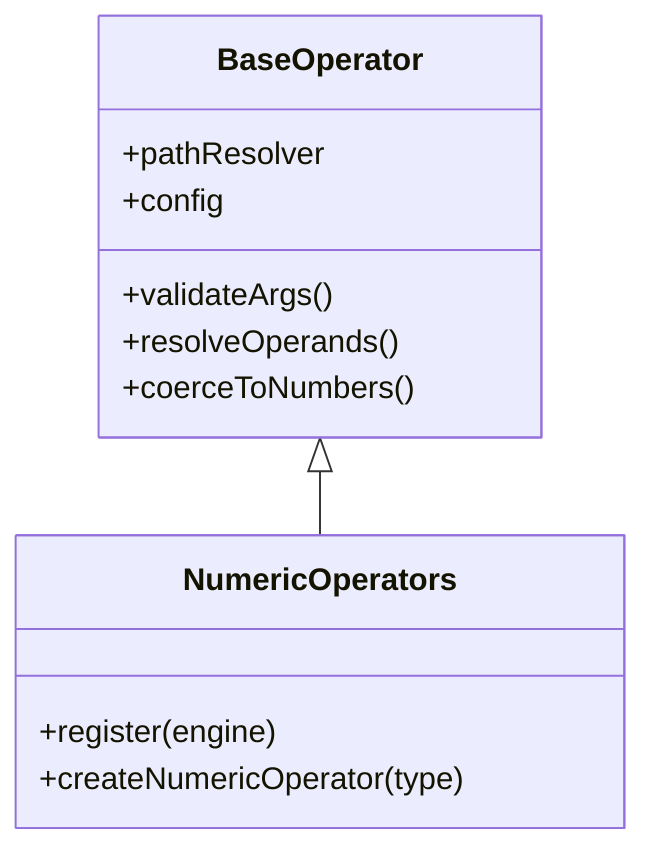

## Overview

Numeric operators perform numerical comparisons between values. Rule Engine JS provides four numeric comparison operators:

<CardGroup cols={2}>
  <Card title="gt" icon="greater-than">
    Greater than (&gt;)
  </Card>
  <Card title="gte" icon="greater-than-equal">
    Greater than or equal (≥)
  </Card>
  <Card title="lt" icon="less-than">
    Less than (&lt;)
  </Card>
  <Card title="lte" icon="less-than-equal">
    Less than or equal (≤)
  </Card>
</CardGroup>

## Architecture



**Source:** `src/operators/numeric.js` | **Tests:** `tests/unit/operators/numeric.test.js`

### Key Features

- **Automatic type coercion** - Converts string numbers to numeric values
- **Dynamic comparison** - Compare two field values or field to literal
- **Strict mode** - Prevent coercion when needed
- **NaN handling** - Proper error handling for invalid numbers

## Syntax

All numeric operators follow the same pattern:

```javascript
{ operator: [left, right] }
{ operator: [left, right, options] }
```

### Parameters

<ParamField path="left" type="number | string" required>
  Left operand - field path or literal value
</ParamField>

<ParamField path="right" type="number | string" required>
  Right operand - field path or literal value
</ParamField>

<ParamField path="options" type="object" optional>
  <Expandable title="properties">
    <ParamField path="strict" type="boolean" default="false">
      Enable strict type checking - prevents string to number coercion
    </ParamField>
  </Expandable>
</ParamField>

## Operators

### `gt` - Greater Than

```javascript
{ gt: ['age', 18] }           // age > 18
{ gt: ['score', 'threshold'] } // Dynamic comparison
```

**Examples:**

```javascript
const data = { age: 25, price: 99.99, minPrice: 50 };

engine.evaluateExpr({ gt: ['age', 18] }, data);
// Result: { success: true } - 25 > 18

engine.evaluateExpr({ gt: ['price', 'minPrice'] }, data);
// Result: { success: true } - 99.99 > 50

engine.evaluateExpr({ gt: ['age', 30] }, data);
// Result: { success: false } - 25 not > 30
```

### `gte` - Greater Than or Equal

```javascript
{ gte: ['age', 18] }            // age >= 18
{ gte: ['score', 'passScore'] } // Dynamic comparison
```

**Examples:**

```javascript
const data = { age: 18, score: 85, passScore: 85 };

engine.evaluateExpr({ gte: ['age', 18] }, data);
// Result: { success: true } - 18 >= 18

engine.evaluateExpr({ gte: ['score', 'passScore'] }, data);
// Result: { success: true } - 85 >= 85
```

### `lt` - Less Than

```javascript
{ lt: ['price', 100] }       // price < 100
{ lt: ['temp', 'maxTemp'] }  // Dynamic comparison
```

**Examples:**

```javascript
const data = { price: 49.99, temperature: 25, maxTemp: 30 };

engine.evaluateExpr({ lt: ['price', 100] }, data);
// Result: { success: true } - 49.99 < 100

engine.evaluateExpr({ lt: ['temperature', 'maxTemp'] }, data);
// Result: { success: true } - 25 < 30
```

### `lte` - Less Than or Equal

```javascript
{ lte: ['quantity', 100] }    // quantity <= 100
{ lte: ['value', 'maxVal'] }  // Dynamic comparison
```

**Examples:**

```javascript
const data = { quantity: 100, discount: 20, maxDiscount: 25 };

engine.evaluateExpr({ lte: ['quantity', 100] }, data);
// Result: { success: true } - 100 <= 100

engine.evaluateExpr({ lte: ['discount', 'maxDiscount'] }, data);
// Result: { success: true } - 20 <= 25
```

## Common Use Cases

<Tabs>
  <Tab title="Age Verification">
    ```javascript
    const user = { age: 25 };

    // Must be adult
    const isAdult = { gte: ['age', 18] };

    // Age range
    const validAge = {
      and: [
        { gte: ['age', 18] },
        { lte: ['age', 65] }
      ]
    };
    ```
  </Tab>

  <Tab title="Price Range">
    ```javascript
    const product = { price: 49.99 };

    // Budget limit
    const withinBudget = { lte: ['price', 100] };

    // Price range
    const affordableRange = {
      and: [
        { gte: ['price', 20] },
        { lte: ['price', 50] }
      ]
    };
    ```
  </Tab>

  <Tab title="Score Validation">
    ```javascript
    const exam = { score: 85, minPass: 70, maxScore: 100 };

    // Passing grade
    const passed = { gte: ['score', 'minPass'] };

    // Valid score
    const validScore = {
      and: [
        { gte: ['score', 0] },
        { lte: ['score', 'maxScore'] }
      ]
    };
    ```
  </Tab>

  <Tab title="Inventory Check">
    ```javascript
    const item = { stock: 5, reorderLevel: 10, maxStock: 100 };

    // Low stock alert
    const lowStock = { lt: ['stock', 'reorderLevel'] };

    // Overstock alert
    const overstock = { gt: ['stock', 'maxStock'] };
    ```
  </Tab>
</Tabs>

## Type Coercion

### Loose Mode (Default)

```javascript
const data = { age: '25', limit: 18 };

// String "25" coerced to number 25
engine.evaluateExpr({ gt: ['age', 'limit'] }, data);
// Result: { success: true } - 25 > 18
```

### Strict Mode

```javascript
const strictEngine = createRuleEngine({ strict: true });

// No coercion - type mismatch error
strictEngine.evaluateExpr({ gt: ['age', 'limit'] }, data);
// Result: { success: false, error: "requires numeric operands" }
```

### Coercion Table

| Input | Loose Mode | Strict Mode |
|-------|------------|-------------|
| `"25"` | `25` ✅ | Error ❌ |
| `25` | `25` ✅ | `25` ✅ |
| `true` | `1` ✅ | Error ❌ |
| `false` | `0` ✅ | Error ❌ |
| `null` | Error ❌ | Error ❌ |
| `"abc"` | Error ❌ | Error ❌ |

## Error Handling

<AccordionGroup>
  <Accordion title="Non-Numeric Values">
    ```javascript
    const data = { name: 'John', age: 25 };

    const result = engine.evaluateExpr({ gt: ['name', 10] }, data);
    // Error: "GT operator requires numeric operands"
    ```
  </Accordion>

  <Accordion title="Missing Arguments">
    ```javascript
    const result = engine.evaluateExpr({ gt: ['age'] }, data);
    // Error: "GT operator requires 2-3 arguments, got 1"
    ```
  </Accordion>

  <Accordion title="Undefined Fields">
    ```javascript
    const data = { age: 25 };

    const result = engine.evaluateExpr({ gt: ['score', 10] }, data);
    // Error: "GT operator requires numeric operands"
    // (undefined cannot be coerced to number)
    ```
  </Accordion>
</AccordionGroup>

## Quick Reference

| Operator | Symbol | True When | Example |
|----------|--------|-----------|---------|
| `gt` | &gt; | left &gt; right | `25 > 18` → true |
| `gte` | ≥ | left ≥ right | `18 ≥ 18` → true |
| `lt` | &lt; | left &lt; right | `10 < 20` → true |
| `lte` | ≤ | left ≤ right | `20 ≤ 20` → true |

## Related Operators

<CardGroup cols={3}>
  <Card title="Comparison" icon="equals" href="/operators/comparison">
    eq, neq
  </Card>
  <Card title="Special" icon="star" href="/operators/special">
    between, isNull
  </Card>
  <Card title="Logical" icon="circle-nodes" href="/operators/logical">
    and, or, not
  </Card>
  <Card title="Array" icon="list" href="/operators/array">
    in, notIn
  </Card>
  <Card title="String" icon="text" href="/operators/string">
    contains, startsWith
  </Card>
  <Card title="All Operators" icon="list-check" href="/operators/overview">
    Complete reference
  </Card>
</CardGroup>

## API Reference

- [RuleEngine API](/api-reference/rule-engine)
- [Rule Helpers API](/api-reference/rule-helpers)
- [Performance Guide](/guides/performance)
