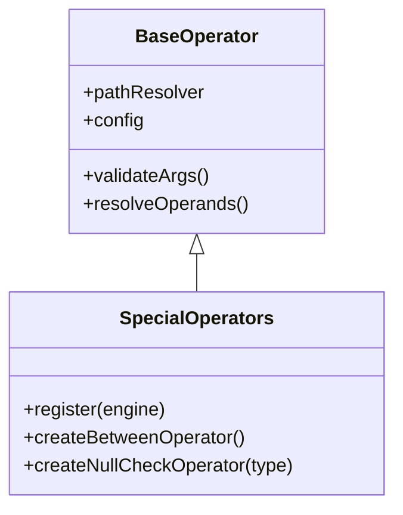

## Overview

Special operators provide range checking and null validation capabilities:

<CardGroup cols={3}>
  <Card title="between" icon="arrows-left-right">
    Check if value is within range
  </Card>
  <Card title="isNull" icon="circle-xmark">
    Check if value is null/undefined
  </Card>
  <Card title="isNotNull" icon="circle-check">
    Check if value exists
  </Card>
</CardGroup>

## Architecture



**Source:** `src/operators/special.js` | **Tests:** `tests/unit/operators/special.test.js`

## `between` - Range Check

Check if a value is within a range (inclusive).

### Syntax

```javascript
{ between: [value, [min, max]] }
{ between: [value, range] }        // Dynamic range
```

### Parameters

<ParamField path="value" type="number" required>
  Value to check - field path or literal
</ParamField>

<ParamField path="range" type="[number, number]" required>
  Range as `[min, max]` array - literal or field path
</ParamField>

### Returns

`boolean` - `true` if `min ≤ value ≤ max`, `false` otherwise

### Examples

<Tabs>
  <Tab title="Basic Range">
    ```javascript
    const data = { age: 25, score: 85, price: 49.99 };

    // Age between 18 and 65
    engine.evaluateExpr({ between: ['age', [18, 65]] }, data);
    // Result: { success: true } - 18 ≤ 25 ≤ 65

    // Score between 0 and 100
    engine.evaluateExpr({ between: ['score', [0, 100]] }, data);
    // Result: { success: true } - 0 ≤ 85 ≤ 100

    // Price in budget range
    engine.evaluateExpr({ between: ['price', [20, 50]] }, data);
    // Result: { success: true } - 20 ≤ 49.99 ≤ 50
    ```
  </Tab>

  <Tab title="Dynamic Range">
    ```javascript
    const data = {
      temperature: 25,
      config: {
        minTemp: 18,
        maxTemp: 30,
        range: [18, 30]
      }
    };

    // Range from field
    engine.evaluateExpr({ between: ['temperature', 'config.range'] }, data);
    // Result: { success: true }
    ```
  </Tab>

  <Tab title="Common Use Cases">
    ```javascript
    // Age verification
    const ageRule = { between: ['age', [18, 120]] };

    // Price range filter
    const priceFilter = { between: ['price', [10, 100]] };

    // Score validation
    const validScore = { between: ['score', [0, 100]] };

    // Temperature monitoring
    const tempOK = { between: ['temp', [15, 30]] };

    // Discount range
    const validDiscount = { between: ['discount', [0, 50]] };
    ```
  </Tab>
</Tabs>

### Notes

<Warning>
  **Inclusive**: Both min and max are included. `between: [10, 20]` matches 10, 15, and 20.
</Warning>

<Info>
  **Alternative**: You can use `{ and: [{ gte: [value, min] }, { lte: [value, max] }] }` for the same effect.
</Info>

## `isNull` - Null Check

Check if a value is `null` or `undefined`.

### Syntax

```javascript
{ isNull: ['fieldPath'] }
```

### Parameters

<ParamField path="field" type="string" required>
  Field path to check
</ParamField>

### Returns

`boolean` - `true` if value is `null`, `undefined`, or field doesn't exist

### Examples

<Tabs>
  <Tab title="Basic Null Check">
    ```javascript
    const data = {
      name: 'John',
      age: null,
      email: undefined,
      // status field doesn't exist
    };

    // Check null value
    engine.evaluateExpr({ isNull: ['age'] }, data);
    // Result: { success: true }

    // Check undefined value
    engine.evaluateExpr({ isNull: ['email'] }, data);
    // Result: { success: true }

    // Check missing field
    engine.evaluateExpr({ isNull: ['status'] }, data);
    // Result: { success: true }

    // Check existing value
    engine.evaluateExpr({ isNull: ['name'] }, data);
    // Result: { success: false }
    ```
  </Tab>

  <Tab title="Optional Fields">
    ```javascript
    const user = {
      name: 'John',
      middleName: null,
      // lastName is undefined
    };

    // Check optional fields
    const hasMiddleName = { not: [{ isNull: ['middleName'] }] };
    const hasLastName = { not: [{ isNull: ['lastName'] }] };

    engine.evaluateExpr(hasMiddleName, user);
    // Result: { success: false } - middleName is null

    engine.evaluateExpr(hasLastName, user);
    // Result: { success: false } - lastName is undefined
    ```
  </Tab>

  <Tab title="Validation">
    ```javascript
    const form = {
      firstName: 'John',
      lastName: 'Doe',
      middleName: null
    };

    // Required fields must not be null
    const validForm = {
      and: [
        { not: [{ isNull: ['firstName'] }] },
        { not: [{ isNull: ['lastName'] }] }
      ]
    };

    engine.evaluateExpr(validForm, form);
    // Result: { success: true }
    ```
  </Tab>
</Tabs>

## `isNotNull` - Not Null Check

Check if a value exists (not `null` or `undefined`).

### Syntax

```javascript
{ isNotNull: ['fieldPath'] }
```

### Parameters

<ParamField path="field" type="string" required>
  Field path to check
</ParamField>

### Returns

`boolean` - `true` if value exists and is not `null` or `undefined`

### Examples

<Tabs>
  <Tab title="Basic Existence Check">
    ```javascript
    const data = {
      name: 'John',
      age: 25,
      email: null,
      // phone is undefined
    };

    // Check value exists
    engine.evaluateExpr({ isNotNull: ['name'] }, data);
    // Result: { success: true }

    // Check age exists
    engine.evaluateExpr({ isNotNull: ['age'] }, data);
    // Result: { success: true }

    // Check null value
    engine.evaluateExpr({ isNotNull: ['email'] }, data);
    // Result: { success: false }

    // Check missing field
    engine.evaluateExpr({ isNotNull: ['phone'] }, data);
    // Result: { success: false }
    ```
  </Tab>

  <Tab title="Required Fields">
    ```javascript
    const registration = {
      username: 'john_doe',
      email: 'john@example.com',
      password: 'secret123',
      phone: null
    };

    // All required fields must exist
    const validRegistration = {
      and: [
        { isNotNull: ['username'] },
        { isNotNull: ['email'] },
        { isNotNull: ['password'] }
      ]
    };

    engine.evaluateExpr(validRegistration, registration);
    // Result: { success: true }
    ```
  </Tab>

  <Tab title="Conditional Logic">
    ```javascript
    const order = {
      total: 150,
      discount: 10,
      couponCode: 'SAVE10'
      // shippingAddress may be null
    };

    // Apply discount only if coupon exists
    const hasDiscount = {
      and: [
        { isNotNull: ['couponCode'] },
        { gt: ['discount', 0] }
      ]
    };

    engine.evaluateExpr(hasDiscount, order);
    // Result: { success: true }
    ```
  </Tab>
</Tabs>

### Notes

<Info>
  **Inverse**: `isNotNull` is equivalent to `{ not: [{ isNull: [field] }] }`
</Info>

## Common Patterns

<AccordionGroup>
  <Accordion title="Age Range Validation">
    ```javascript
    const user = { age: 25 };

    const validAge = {
      and: [
        { isNotNull: ['age'] },
        { between: ['age', [18, 120]] }
      ]
    };
    ```
  </Accordion>

  <Accordion title="Price Filter">
    ```javascript
    const product = { price: 49.99 };

    const affordableProduct = {
      and: [
        { isNotNull: ['price'] },
        { between: ['price', [10, 100]] }
      ]
    };
    ```
  </Accordion>

  <Accordion title="Optional Field Handling">
    ```javascript
    const user = { name: 'John', middleName: null };

    const fullName = {
      or: [
        { isNotNull: ['middleName'] },
        { isNotNull: ['name'] }
      ]
    };
    ```
  </Accordion>

  <Accordion title="Score Validation">
    ```javascript
    const exam = { score: 85 };

    const validScore = {
      and: [
        { isNotNull: ['score'] },
        { between: ['score', [0, 100]] }
      ]
    };
    ```
  </Accordion>
</AccordionGroup>

## Error Handling

<AccordionGroup>
  <Accordion title="Invalid Range Format">
    ```javascript
    // Wrong: range is not an array
    const result = engine.evaluateExpr({ between: ['age', 18] }, data);
    // Error: "BETWEEN operator requires array of 2 values"

    // Wrong: array has wrong length
    const result2 = engine.evaluateExpr({ between: ['age', [18]] }, data);
    // Error: "BETWEEN operator requires array of 2 values"

    // Correct:
    engine.evaluateExpr({ between: ['age', [18, 65]] }, data);
    ```
  </Accordion>

  <Accordion title="Non-Numeric Values">
    ```javascript
    const data = { name: 'John' };

    const result = engine.evaluateExpr({ between: ['name', [1, 10]] }, data);
    // Error: "BETWEEN operator requires numeric operands"
    ```
  </Accordion>

  <Accordion title="Missing Arguments">
    ```javascript
    // BETWEEN requires 2 arguments
    const result = engine.evaluateExpr({ between: ['age'] }, data);
    // Error: "BETWEEN operator requires 2 arguments"

    // IS_NULL requires 1 argument
    const result2 = engine.evaluateExpr({ isNull: [] }, data);
    // Error: "IS_NULL operator requires 1 arguments"
    ```
  </Accordion>
</AccordionGroup>

## Quick Reference

| Operator | Purpose | Example | Result |
|----------|---------|---------|--------|
| `between` | Range check (inclusive) | `{ between: [25, [18, 65]] }` | true |
| `isNull` | Check if null/undefined | `{ isNull: ['email'] }` | true if null |
| `isNotNull` | Check if exists | `{ isNotNull: ['name'] }` | true if exists |

## Related Operators

<CardGroup cols={3}>
  <Card title="Numeric" icon="greater-than-equal" href="/operators/numeric">
    gt, gte, lt, lte
  </Card>
  <Card title="Comparison" icon="equals" href="/operators/comparison">
    eq, neq
  </Card>
  <Card title="Logical" icon="circle-nodes" href="/operators/logical">
    and, or, not
  </Card>
  <Card title="Array" icon="list" href="/operators/array">
    in, notIn
  </Card>
  <Card title="String" icon="text" href="/operators/string">
    contains, startsWith
  </Card>
  <Card title="All Operators" icon="list-check" href="/operators/overview">
    Complete reference
  </Card>
</CardGroup>

## API Reference

- [RuleEngine API](/api-reference/rule-engine)
- [Rule Helpers API](/api-reference/rule-helpers)
- [Performance Guide](/guides/performance)
