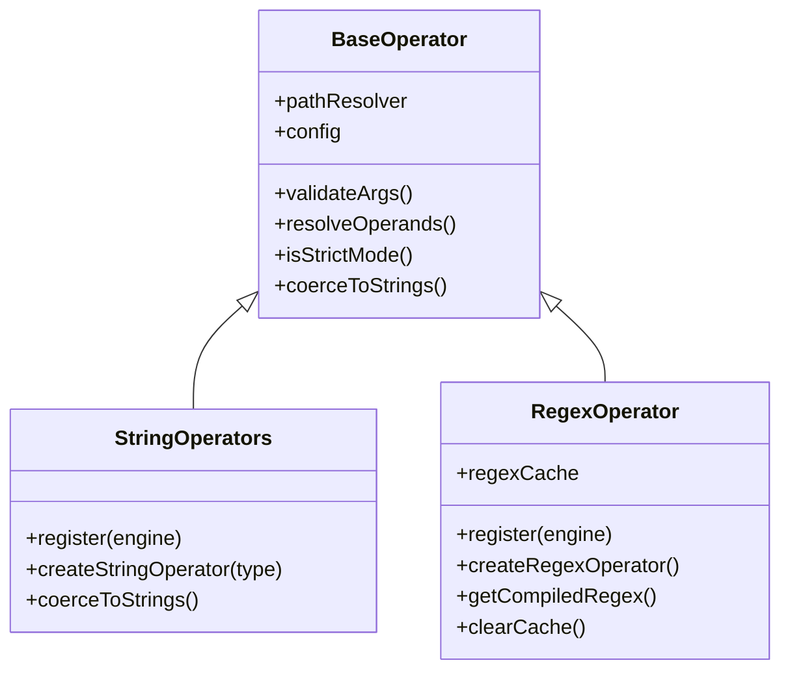

## Overview

String operators enable powerful text matching and validation capabilities. Rule Engine JS provides four string operators for different text comparison needs:

<CardGroup cols={2}>
  <Card title="contains" icon="magnifying-glass">
    Check if string contains substring
  </Card>
  <Card title="startsWith" icon="arrow-right-to-bracket">
    Check if string starts with prefix
  </Card>
  <Card title="endsWith" icon="arrow-right-from-bracket">
    Check if string ends with suffix
  </Card>
  <Card title="regex" icon="brackets-curly">
    Match against regular expression patterns
  </Card>
</CardGroup>

## Architecture

String operators are implemented across two classes extending `BaseOperator`:



**Source Files:**

- String operators: `src/operators/string.js`
- Regex operator: `src/operators/regex.js`
- Base operator: `src/operators/base/BaseOperator.js`
- Type utilities: `src/utils/TypeUtils.js`
- Unit tests: `tests/unit/operators/string.test.js`

### Key Features

- **Dynamic field comparison** - Compare two fields or field to literal value
- **Case sensitive by default** - Exact matching for security
- **Automatic type coercion** - Non-string values converted to strings
- **Pattern caching** - Regex patterns cached for performance
- **Comprehensive validation** - Validates argument count and types

## `contains` - Substring Match

Check if a string contains a substring.

### Syntax

```javascript
{ contains: [haystack, needle] }
{ contains: [haystack, needle, options] }
```

### Parameters

<ParamField path="haystack" type="string" required>
  The string to search in - field path or literal value
</ParamField>

<ParamField path="needle" type="string" required>
  The substring to search for - field path or literal value
</ParamField>

<ParamField path="options" type="object" optional>
  Configuration options

  <Expandable title="properties">
    <ParamField path="strict" type="boolean" default="false">
      Enable strict type checking - prevents automatic string coercion
    </ParamField>
  </Expandable>
</ParamField>

### Returns

`boolean` - `true` if haystack contains needle, `false` otherwise

### Examples

<Tabs>
  <Tab title="Basic Contains">
    ```javascript
    import { createRuleEngine } from 'rule-engine-js';

    const engine = createRuleEngine();
    const data = {
      user: {
        email: 'john@company.com',
        bio: 'Software Engineer at TechCorp',
      }
    };

    // Check if email contains domain
    engine.evaluateExpr({ contains: ['user.email', '@company.com'] }, data);
    // Result: { success: true }

    // Check bio for keyword
    engine.evaluateExpr({ contains: ['user.bio', 'Software'] }, data);
    // Result: { success: true }

    // Case sensitive - will fail
    engine.evaluateExpr({ contains: ['user.bio', 'software'] }, data);
    // Result: { success: false }
    ```
  </Tab>

  <Tab title="Dynamic Field Comparison">
    ```javascript
    const messageData = {
      message: {
        text: 'Hello World from the API',
        searchTerm: 'Hello'
      }
    };

    // Compare two fields
    engine.evaluateExpr(
      { contains: ['message.text', 'message.searchTerm'] },
      messageData
    );
    // Result: { success: true }
    ```
  </Tab>

  <Tab title="Email Domain Validation">
    ```javascript
    const users = [
      { email: 'john@company.com' },
      { email: 'jane@gmail.com' },
      { email: 'admin@company.com' }
    ];

    // Filter company emails
    const companyEmailRule = { contains: ['email', '@company.com'] };

    users.forEach(user => {
      const result = engine.evaluateExpr(companyEmailRule, user);
      console.log(`${user.email}: ${result.success}`);
    });
    // john@company.com: true
    // jane@gmail.com: false
    // admin@company.com: true
    ```
  </Tab>

  <Tab title="With Rule Helpers">
    ```javascript
    import { createRuleHelpers } from 'rule-engine-js';

    const rules = createRuleHelpers();
    const data = { title: 'JavaScript Tutorial 2024' };

    // Cleaner syntax with helpers
    const rule = rules.contains('title', 'JavaScript');

    engine.evaluateExpr(rule, data);
    // Result: { success: true }
    ```
  </Tab>
</Tabs>

### Common Use Cases

<AccordionGroup>
  <Accordion title="Search Functionality">
    ```javascript
    const article = {
      title: 'Introduction to React Hooks',
      content: 'React Hooks provide a way to use state...',
      tags: ['react', 'hooks', 'javascript']
    };

    // Search in title or content
    const searchRule = {
      or: [
        { contains: ['title', 'React'] },
        { contains: ['content', 'React'] }
      ]
    };

    engine.evaluateExpr(searchRule, article);
    // Result: { success: true }
    ```
  </Accordion>

  <Accordion title="Content Filtering">
    ```javascript
    const post = {
      content: 'Check out this amazing product!',
      author: 'spammer@example.com'
    };

    // Filter spam content
    const spamRule = {
      or: [
        { contains: ['content', 'amazing product'] },
        { contains: ['content', 'click here'] },
        { contains: ['author', 'spammer'] }
      ]
    };

    engine.evaluateExpr(spamRule, post);
    // Result: { success: true } - Flagged as spam
    ```
  </Accordion>

  <Accordion title="Category Matching">
    ```javascript
    const product = {
      name: 'MacBook Pro 16-inch',
      category: 'Electronics > Computers > Laptops'
    };

    // Check product category
    const isLaptop = { contains: ['category', 'Laptops'] };
    const isElectronics = { contains: ['category', 'Electronics'] };

    engine.evaluateExpr(isLaptop, product);
    // Result: { success: true }
    ```
  </Accordion>
</AccordionGroup>

<Warning>
  **Case Sensitivity**: `contains` is case-sensitive by default. "Software" !== "software"
</Warning>

## `startsWith` - Prefix Match

Check if a string starts with a specific prefix.

### Syntax

```javascript
{ startsWith: [string, prefix] }
{ startsWith: [string, prefix, options] }
```

### Parameters

<ParamField path="string" type="string" required>
  The string to check - field path or literal value
</ParamField>

<ParamField path="prefix" type="string" required>
  The prefix to match - field path or literal value
</ParamField>

<ParamField path="options" type="object" optional>
  Configuration options

  <Expandable title="properties">
    <ParamField path="strict" type="boolean" default="false">
      Enable strict type checking
    </ParamField>
  </Expandable>
</ParamField>

### Returns

`boolean` - `true` if string starts with prefix, `false` otherwise

### Examples

<Tabs>
  <Tab title="Basic StartsWith">
    ```javascript
    const data = {
      user: {
        name: 'John Doe',
        username: 'john_doe_123'
      },
      url: 'https://example.com/page'
    };

    // Check name prefix
    engine.evaluateExpr({ startsWith: ['user.name', 'John'] }, data);
    // Result: { success: true }

    // Check URL protocol
    engine.evaluateExpr({ startsWith: ['url', 'https'] }, data);
    // Result: { success: true }

    // Check username pattern
    engine.evaluateExpr({ startsWith: ['user.username', 'john_'] }, data);
    // Result: { success: true }
    ```
  </Tab>

  <Tab title="Dynamic Prefix">
    ```javascript
    const urlData = {
      url: {
        full: 'https://api.example.com/v1/users',
        protocol: 'https',
        baseUrl: 'https://api.example.com'
      }
    };

    // Verify protocol
    engine.evaluateExpr(
      { startsWith: ['url.full', 'url.protocol'] },
      urlData
    );
    // Result: { success: true }

    // Verify base URL
    engine.evaluateExpr(
      { startsWith: ['url.full', 'url.baseUrl'] },
      urlData
    );
    // Result: { success: true }
    ```
  </Tab>

  <Tab title="ID Prefix Validation">
    ```javascript
    const records = [
      { id: 'USER_12345', type: 'user' },
      { id: 'ORDER_67890', type: 'order' },
      { id: 'PROD_54321', type: 'product' }
    ];

    // Validate ID format matches type
    records.forEach(record => {
      const expectedPrefix = record.type.toUpperCase() + '_';
      const rule = { startsWith: ['id', expectedPrefix] };

      const result = engine.evaluateExpr(rule, record);
      console.log(`${record.id}: ${result.success}`);
    });
    // USER_12345: true
    // ORDER_67890: false (doesn't start with ORDER_)
    // PROD_54321: false (doesn't start with PRODUCT_)
    ```
  </Tab>
</Tabs>

### Common Use Cases

<AccordionGroup>
  <Accordion title="URL Protocol Validation">
    ```javascript
    const links = [
      { url: 'https://secure.example.com' },
      { url: 'http://example.com' },
      { url: 'ftp://files.example.com' }
    ];

    // Only allow HTTPS
    const httpsOnly = { startsWith: ['url', 'https://'] };

    links.forEach(link => {
      const result = engine.evaluateExpr(httpsOnly, link);
      console.log(`${link.url}: ${result.success}`);
    });
    ```
  </Accordion>

  <Accordion title="File Path Validation">
    ```javascript
    const file = {
      path: '/app/uploads/images/photo.jpg',
      allowedPrefix: '/app/uploads/'
    };

    // Ensure file is in allowed directory
    const inAllowedDir = {
      startsWith: ['path', 'allowedPrefix']
    };

    engine.evaluateExpr(inAllowedDir, file);
    // Result: { success: true }
    ```
  </Accordion>

  <Accordion title="Phone Number Format">
    ```javascript
    const contact = {
      phone: '+1-555-123-4567',
      country: 'US'
    };

    // Validate US phone number format
    const usPhoneRule = { startsWith: ['phone', '+1-'] };

    engine.evaluateExpr(usPhoneRule, contact);
    // Result: { success: true }
    ```
  </Accordion>
</AccordionGroup>

## `endsWith` - Suffix Match

Check if a string ends with a specific suffix.

### Syntax

```javascript
{ endsWith: [string, suffix] }
{ endsWith: [string, suffix, options] }
```

### Parameters

<ParamField path="string" type="string" required>
  The string to check - field path or literal value
</ParamField>

<ParamField path="suffix" type="string" required>
  The suffix to match - field path or literal value
</ParamField>

<ParamField path="options" type="object" optional>
  Configuration options

  <Expandable title="properties">
    <ParamField path="strict" type="boolean" default="false">
      Enable strict type checking
    </ParamField>
  </Expandable>
</ParamField>

### Returns

`boolean` - `true` if string ends with suffix, `false` otherwise

### Examples

<Tabs>
  <Tab title="Basic EndsWith">
    ```javascript
    const data = {
      user: {
        email: 'john@company.com',
      },
      file: {
        name: 'document.pdf',
        backup: 'document.pdf.bak'
      }
    };

    // Check email domain
    engine.evaluateExpr({ endsWith: ['user.email', '.com'] }, data);
    // Result: { success: true }

    // Check file extension
    engine.evaluateExpr({ endsWith: ['file.name', '.pdf'] }, data);
    // Result: { success: true }

    // Check backup file
    engine.evaluateExpr({ endsWith: ['file.backup', '.bak'] }, data);
    // Result: { success: true }
    ```
  </Tab>

  <Tab title="Dynamic Suffix">
    ```javascript
    const fileData = {
      file: {
        name: 'report_2024.pdf',
        extension: '.pdf',
        requiredFormat: '.pdf'
      }
    };

    // Verify file extension matches
    engine.evaluateExpr(
      { endsWith: ['file.name', 'file.extension'] },
      fileData
    );
    // Result: { success: true }

    // Verify required format
    engine.evaluateExpr(
      { endsWith: ['file.name', 'file.requiredFormat'] },
      fileData
    );
    // Result: { success: true }
    ```
  </Tab>

  <Tab title="File Type Validation">
    ```javascript
    const uploads = [
      { filename: 'photo.jpg', allowed: true },
      { filename: 'document.pdf', allowed: true },
      { filename: 'script.exe', allowed: false },
      { filename: 'data.json', allowed: true }
    ];

    const allowedExtensions = ['.jpg', '.pdf', '.png', '.json'];

    uploads.forEach(upload => {
      // Check if file has allowed extension
      const rules = allowedExtensions.map(ext => ({
        endsWith: ['filename', ext]
      }));

      const result = engine.evaluateExpr({ or: rules }, upload);
      console.log(`${upload.filename}: ${result.success}`);
    });
    ```
  </Tab>
</Tabs>

### Common Use Cases

<AccordionGroup>
  <Accordion title="File Upload Validation">
    ```javascript
    const upload = {
      filename: 'profile-photo.jpg',
      allowedTypes: ['.jpg', '.jpeg', '.png', '.gif']
    };

    // Accept only image files
    const imageRule = {
      or: [
        { endsWith: ['filename', '.jpg'] },
        { endsWith: ['filename', '.jpeg'] },
        { endsWith: ['filename', '.png'] },
        { endsWith: ['filename', '.gif'] }
      ]
    };

    engine.evaluateExpr(imageRule, upload);
    // Result: { success: true }
    ```
  </Accordion>

  <Accordion title="Email Domain Restriction">
    ```javascript
    const user = {
      email: 'employee@company.com',
      isInternal: true
    };

    // Only allow company email
    const companyEmailRule = {
      and: [
        { endsWith: ['email', '@company.com'] },
        { eq: ['isInternal', true] }
      ]
    };

    engine.evaluateExpr(companyEmailRule, user);
    // Result: { success: true }
    ```
  </Accordion>

  <Accordion title="URL Path Matching">
    ```javascript
    const request = {
      path: '/api/v1/users/profile.json',
      requiresJson: true
    };

    // API must return JSON
    const jsonApiRule = {
      and: [
        { startsWith: ['path', '/api/'] },
        { endsWith: ['path', '.json'] }
      ]
    };

    engine.evaluateExpr(jsonApiRule, request);
    // Result: { success: true }
    ```
  </Accordion>
</AccordionGroup>

## `regex` - Regular Expression Match

Match strings against regular expression patterns with support for flags and pattern caching.

### Syntax

```javascript
{ regex: [text, pattern] }
{ regex: [text, pattern, options] }
```

### Parameters

<ParamField path="text" type="string" required>
  The text to match against - field path or literal value
</ParamField>

<ParamField path="pattern" type="string" required>
  The regular expression pattern - field path or literal value
</ParamField>

<ParamField path="options" type="object" optional>
  Configuration options

  <Expandable title="properties">
    <ParamField path="flags" type="string" default="">
      Regex flags: `i` (case-insensitive), `g` (global), `m` (multiline), etc.
    </ParamField>
    <ParamField path="strict" type="boolean" default="false">
      Enable strict type checking
    </ParamField>
  </Expandable>
</ParamField>

### Returns

`boolean` - `true` if text matches pattern, `false` otherwise

### Examples

<Tabs>
  <Tab title="Email Validation">
    ```javascript
    const user = {
      email: 'john.doe@company.com'
    };

    // Validate email format
    const emailRule = {
      regex: ['email', '^[\\w\\.-]+@[\\w\\.-]+\\.[a-zA-Z]{2,}$']
    };

    engine.evaluateExpr(emailRule, user);
    // Result: { success: true }

    // Test with invalid email
    const invalidUser = { email: 'invalid.email' };
    engine.evaluateExpr(emailRule, invalidUser);
    // Result: { success: false }
    ```
  </Tab>

  <Tab title="Phone Number Validation">
    ```javascript
    const contact = {
      phone: '+1-555-123-4567',
      mobile: '555-987-6543'
    };

    // US phone number format
    const phoneRule = {
      regex: ['phone', '^\\+?[1-9]\\d{0,2}-?\\d{3}-?\\d{3}-?\\d{4}$']
    };

    engine.evaluateExpr(phoneRule, contact);
    // Result: { success: true }

    // Mobile without country code
    const mobileRule = {
      regex: ['mobile', '^\\d{3}-\\d{3}-\\d{4}$']
    };

    engine.evaluateExpr(mobileRule, contact);
    // Result: { success: true }
    ```
  </Tab>

  <Tab title="Case-Insensitive Search">
    ```javascript
    const article = {
      content: 'Learn about JavaScript and React',
      bio: 'Software Engineer specializing in web development'
    };

    // Case-insensitive keyword search
    const jsRule = {
      regex: ['content', 'javascript', { flags: 'i' }]
    };

    engine.evaluateExpr(jsRule, article);
    // Result: { success: true } (matches "JavaScript")

    // Case-insensitive word boundary
    const techRule = {
      regex: ['bio', '\\bsoftware\\b', { flags: 'i' }]
    };

    engine.evaluateExpr(techRule, article);
    // Result: { success: true }
    ```
  </Tab>

  <Tab title="Dynamic Patterns">
    ```javascript
    const validation = {
      data: {
        text: 'Order#12345',
        pattern: '#\\d+$'
      }
    };

    // Use pattern from data
    const dynamicRule = {
      regex: ['data.text', 'data.pattern']
    };

    engine.evaluateExpr(dynamicRule, validation);
    // Result: { success: true }
    ```
  </Tab>

  <Tab title="Password Strength">
    ```javascript
    const user = {
      password: 'SecurePass123!'
    };

    // Strong password: 8+ chars, uppercase, lowercase, number, special char
    const strongPasswordRule = {
      and: [
        { regex: ['password', '.{8,}'] },              // Min 8 characters
        { regex: ['password', '(?=.*[a-z])'] },        // Has lowercase
        { regex: ['password', '(?=.*[A-Z])'] },        // Has uppercase
        { regex: ['password', '(?=.*\\d)'] },          // Has number
        { regex: ['password', '(?=.*[!@#$%^&*])'] }    // Has special char
      ]
    };

    engine.evaluateExpr(strongPasswordRule, user);
    // Result: { success: true }
    ```
  </Tab>
</Tabs>

### Common Use Cases

<AccordionGroup>
  <Accordion title="URL Validation">
    ```javascript
    const link = {
      url: 'https://www.example.com/path?query=value'
    };

    // Validate URL format
    const urlRule = {
      regex: ['url', '^https?:\\/\\/[\\w\\.-]+(:[\\d]+)?(\\/[\\w\\.-]*)*\\??([\\w=&]*)$']
    };

    engine.evaluateExpr(urlRule, link);
    // Result: { success: true }
    ```
  </Accordion>

  <Accordion title="Credit Card Validation">
    ```javascript
    const payment = {
      cardNumber: '4532-1234-5678-9010'
    };

    // Validate credit card format (Visa)
    const visaRule = {
      regex: ['cardNumber', '^4[0-9]{3}-?[0-9]{4}-?[0-9]{4}-?[0-9]{4}$']
    };

    engine.evaluateExpr(visaRule, payment);
    // Result: { success: true }
    ```
  </Accordion>

  <Accordion title="Date Format Validation">
    ```javascript
    const event = {
      date: '2024-12-25',
      time: '14:30:00'
    };

    // Validate ISO date format
    const dateRule = {
      regex: ['date', '^\\d{4}-\\d{2}-\\d{2}$']
    };

    // Validate time format
    const timeRule = {
      regex: ['time', '^([01]\\d|2[0-3]):[0-5]\\d:[0-5]\\d$']
    };

    engine.evaluateExpr({ and: [dateRule, timeRule] }, event);
    // Result: { success: true }
    ```
  </Accordion>

  <Accordion title="Username Validation">
    ```javascript
    const user = {
      username: 'john_doe_123'
    };

    // Username: 3-20 chars, alphanumeric + underscore
    const usernameRule = {
      regex: ['username', '^[a-zA-Z0-9_]{3,20}$']
    };

    engine.evaluateExpr(usernameRule, user);
    // Result: { success: true }
    ```
  </Accordion>
</AccordionGroup>

<Info>
  **Performance**: Regex patterns are cached automatically for better performance when evaluating the same pattern multiple times.
</Info>

## Error Handling

### Common Errors

<AccordionGroup>
  <Accordion title="Non-String Operands">
    ```javascript
    const data = { user: { age: 28 } };

    // Trying to use contains on number
    const result = engine.evaluateExpr(
      { contains: ['user.age', '28'] },
      data
    );

    // Returns:
    // {
    //   success: false,
    //   error: "CONTAINS operator requires string operands"
    // }
    ```
  </Accordion>

  <Accordion title="Invalid Regex Pattern">
    ```javascript
    const data = { text: 'hello' };

    // Invalid regex syntax
    const result = engine.evaluateExpr(
      { regex: ['text', '[invalid('] },
      data
    );

    // Returns:
    // {
    //   success: false,
    //   error: "Invalid regex pattern: [invalid("
    // }
    ```
  </Accordion>

  <Accordion title="Missing Arguments">
    ```javascript
    // Missing second argument
    const result = engine.evaluateExpr(
      { contains: ['user.email'] },
      data
    );

    // Returns:
    // {
    //   success: false,
    //   error: "CONTAINS operator requires 2-3 arguments, got 1"
    // }
    ```
  </Accordion>

  <Accordion title="Undefined Field Access">
    ```javascript
    const data = { user: { name: 'John' } };

    // Field doesn't exist - undefined coerced to empty string
    const result = engine.evaluateExpr(
      { contains: ['user.email', '@'] },
      data
    );

    // Returns:
    // {
    //   success: false,
    //   error: "CONTAINS operator requires string operands"
    // }
    ```
  </Accordion>
</AccordionGroup>

### Error Recovery

```javascript
function safeStringMatch(engine, operator, field, pattern, data, fallback = false) {
  const result = engine.evaluateExpr({ [operator]: [field, pattern] }, data);

  if (!result.success) {
    console.error(`String match failed: ${result.error}`);
    return fallback;
  }

  return result.success;
}

// Usage
const hasKeyword = safeStringMatch(
  engine,
  'contains',
  'content',
  'important',
  article,
  false
);
```

## Type Coercion

String operators support automatic type coercion in loose mode:

| Input Type | Coercion Behavior | Example |
|------------|-------------------|---------|
| `string` | No change | `"hello"` → `"hello"` |
| `number` | Converted to string | `123` → `"123"` |
| `boolean` | Converted to string | `true` → `"true"` |
| `null` | Error thrown | `null` → Error |
| `undefined` | Error thrown | `undefined` → Error |
| `object` | Error thrown | `{}` → Error |

### Strict Mode

```javascript
const data = { value: 123 };

// Loose mode (default) - coerces number to string
engine.evaluateExpr({ contains: ['value', '12'] }, data);
// Result: { success: true } - "123" contains "12"

// Strict mode - rejects non-string
const strictEngine = createRuleEngine({ strict: true });
strictEngine.evaluateExpr({ contains: ['value', '12'] }, data);
// Result: { success: false, error: "requires string operands" }
```

## Related Operators

<CardGroup cols={3}>
  <Card title="Comparison Operators" icon="equals" href="/operators/comparison">
    eq, neq for exact matching
  </Card>
  <Card title="Array Operators" icon="list" href="/operators/array">
    in, notIn for array membership
  </Card>
  <Card title="Special Operators" icon="star" href="/operators/special">
    isNull, isNotNull, between
  </Card>
  <Card title="Logical Operators" icon="circle-nodes" href="/operators/logical">
    and, or, not for combining rules
  </Card>
  <Card title="Numeric Operators" icon="hashtag" href="/operators/numeric">
    Numeric operations
  </Card>
  <Card title="All Operators" icon="list-check" href="/operators/overview">
    Complete operator reference
  </Card>
</CardGroup>

## API Reference

For complete API documentation:

- [RuleEngine API](/api-reference/rule-engine)
- [Rule Helpers API](/api-reference/rule-helpers)
- [Performance Guide](/guides/performance)
- [Custom Operators](/guides/custom-operators)
